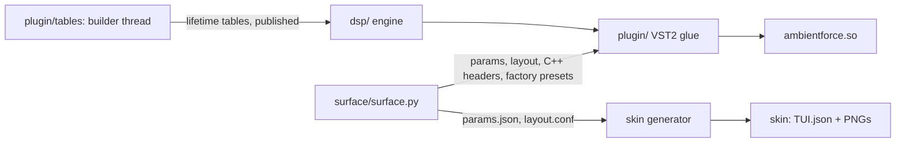
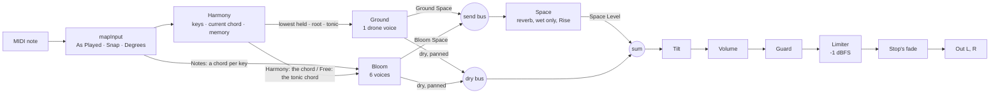

# Architecture

- [Overview](#overview)
- [Source layout](#source-layout)
- [Signal path](#signal-path)
- [Control rate](#control-rate)
- [Threads and real-time rules](#threads-and-real-time-rules)
- [Talking to MPC](#talking-to-mpc)
- [Parameters and saved state](#parameters-and-saved-state)

---

## Overview

AmbientForce is a single shared object, `ambientforce.so`, that MPC loads through its VST2 host as an
instrument (no inputs, 2 outputs), plus a touchscreen skin generated at build time. The plugin side
(VST2 glue, the touchscreen logic, the preset library, saved state, the build, test and bench
tooling) is SubForce's, renamed; the page groups and the reverb are EffectForce's; the wavetable
layout is PolyForce's. The harmony brain, the lifetime tables and their oscillator, Ground, Bloom
and the engine that routes one MIDI stream through them are AmbientForce's own.

- **`surface/surface.py`** is the single source of the parameter list and the touchscreen pages. It
  writes `params.json`, `layout.conf`, `vst.json`, `build/param_ids.h` (ids, value curves, limits,
  option lists, defaults), `build/factory_presets.h` (the factory presets, embedded) and
  `build/skin_style.json` (for `skin_polish.py`), after checking the layout (geometry, names that fit
  MPC's labels, Q-Link sets, page groups) and every factory preset (keys, ranges, names).
- **`dsp/`** is the sound: the harmony brain, the strata, Space and the engine. No VST, no files, no
  threads. It renders a `Patch` for the keys it is given.
- **`plugin/`** is everything between the engine and MPC: VST2 entry points, MIDI, parameters, the
  touchscreen logic, the preset library, saved state, and the process-wide table library with its
  builder thread.

## Source layout

| Path | Contents |
|---|---|
| `dsp/engine.*` | The engine: Listen routing from the keys and the harmony to Ground and Bloom, the pedal and Hold, Stop, the mix and sends, Space's decay hold, the output (tilt, volume, the guard, the limiter, Stop's fade), idling. Its header is the best single summary of how the instrument behaves |
| `dsp/harmony.*` | The harmony brain: scales, Input mapping, diatonic chords, voicings, voice leading, the tunings, and the harmony memory (keys and their mapped notes, the current chord, the memory's timer). Also the `Listen` modes every stratum shares |
| `dsp/ground.*` | Ground, the drone: five partials on one table, beating in Hz, Gravity, the root's octave and Register, the fade, Body, Breath, Tone, Width |
| `dsp/bloom.*` | Bloom, the chord voices: six voices of coupled oscillators, breath, the SVF, the envelope, unison, allocation and owners, the strum, voice-led moves, the tail handoff |
| `dsp/lifeosc.h` | The lifetime oscillator (header-only): the Hermite and linear table reads, frame crossfade and mip choice, `LifeScan` (Age, Sway, Smear), the Couple modes |
| `dsp/lifetime.*` | The table library: eight life models (additive, every harmonic its own decay, beating and formant path) and four digital waves; `TableSet`, the atomic slots the audio thread reads |
| `dsp/wavetable.*` | PolyForce's wavetable layout: 11 mip levels of their own lengths, 16-bit samples with a scale per frame, `mipFor`, and the band-limited frame builder (an inverse FFT per level) |
| `dsp/space.*` | Space: the Reverb as a send / return (wet only), Rise, `silent()` |
| `dsp/reverb.*`, `pitch.h` | EffectForce's Reverb: predelay, low cut, diffusion, an 8-line feedback delay network with modulation, freeze and shimmer; the Haze and Abyss modes added. The shimmer's pitch shifter |
| `dsp/svf.h` | Andrew Simper's trapezoidal state-variable filter (Bloom's filter, Ground's Tone and formants) |
| `dsp/common.h`, `fastmath.h`, `simd.h` | The rate and the control chunk, `Transport`, smoothing; fast exp2, log2, tan, soft clip and random numbers; four-float vectors (NEON on the Force, GCC's generic vectors on x86, so the tests run the same arithmetic) |
| `dsp/stages.h` | Stage timers for the profiling build (`-DAF_STAGE_TIMING`): ground, bloom, space, out |
| `plugin/plugin.cpp` | VST2 glue for an instrument: MIDI with sample offsets, transport, suspend and resume, chunk state, the denormal flush, the CPU meter |
| `plugin/surface.*` | The touchscreen side: parameter values, stepping, popups, the preset browser, pushes to MPC |
| `plugin/patch_map.*` | 0..1 ↔ real values, display text, parameters → `Patch` (the levels' audio taper), then the four macros bending that `Patch` (`applyMacros`); every option list checked against the engine's names as it compiles |
| `plugin/tables.*` | The process-wide `TableSet` and its builder thread: started by the first instance, joined at unload, the tables freed only with no instance alive |
| `plugin/library.*` | The preset library: scan, categories, favorites, recent |
| `plugin/presets.*` | Factory and user presets, and a preset's description (`about=`) |
| `plugin/state.*` | The state text shared by projects and preset files |
| `plugin/paths.*` | Plugin folder, preset roots, data folder, atomic file writes |
| `plugin/trace.*` | Device diagnostics while `/tmp/ambientforce.trace` exists: parameter sets, suspends and resumes, MIDI, table build times ([Building](BUILDING.md#diagnostics-on-the-device)) |
| `plugin/vst2.h` | A hand-written slice of the VST2 ABI (no Steinberg SDK) |
| `plugin/exports.map`, `exports_stages.map` | Linker version scripts: only `VSTPluginMain` exported (plus `AmbientForceStageTimes` in the profiling build) |
| `surface/surface.py` | Parameters, pages, the layout and preset checks; generates everything the skin and the C++ side need |
| `surface/skin_polish.py` | Redraws the knob strips, trigger buttons and stepper arrows after the skin generator; makes each group's pages sub-pages of one tab |
| `surface/fonts/` | Titillium Web (SIL OFL), the skin's font; the layout check measures text with its advance table |
| `presets/Factory/` | Factory presets: `NN_Category/NN_Name.afp`, a folder per browser category |
| `test/plugin_test.cpp` | The suite's `main`; the plugin through its VST2 entry points: basics, getters, playing, Stop and suspend, the status line's help and descriptions, MIDI mapping, stress |
| `test/harmony_test.cpp`, `tables_test.cpp`, `lifeosc_test.cpp`, `ground_test.cpp`, `bloom_test.cpp`, `reverb_test.cpp`, `engine_test.cpp` | Each dsp part on its own ([Building](BUILDING.md#tests)) |
| `test/params_test.cpp`, `preset_test.cpp` | The parameters against the engine, the help lines, the macros; saved state, presets, the browser, stepping, the macros' levels |
| `test/host.h`, `signal.h`, `check.h`, `module_main.cpp` | A fake MPC host; signals, measurements and the tests' FFT; the check counters; the `main` of `make test-module` |
| `tools/bench.cpp` | `afbench`, the CPU bench: `dlopen()`s the `.so` like MPC, waits for the tables, and times every block of five cases |
| `tools/pgo_train.cpp` | The trainer for the profile-guided build (runs under `qemu-arm`): every mode, then every factory preset |
| `tools/phrase.h` | The demo phrase (two held chords and their release, in each preset's own key) and the loudness the presets are matched by; `demos` and `test/preset_test.cpp` share it |
| `tools/demos.cpp` | Renders the factory presets to WAV, level-matches them, and prints what each one measures |
| `tools/soak.cpp`, `loudness.h` | The offline soak test (`make soak`): hours of a long set, failing on a non-finite sample, a guard trip, a peak, DC or loudness drift; BS.1770 loudness in windows |
| `third_party/mpc-vst-plugins/` | Vendored skin generator, previews, installer and catalog checker (MIT), with marked local patches |
| `.github/workflows/build.yml` | CI: the test suites, the glibc 2.31 device build, the package and its catalog check; releases from `vX.Y.Z` tags |

## Signal path

**A key's way in.** A note-on goes through Input (`mapInput`) once, on its way down; the harmony
keeps the key and its mapped note together, so the key's note-off finds its note even if the patch
changed in between, and two keys mapped to one note hold it until both are up. Then every stratum
hears it by its Listen mode:

- **Bloom, Notes**: the chord on the mapped note (`buildChord`, led from the chord Bloom played last
  when Leading is on), owned by the key. **Harmony**: it moves to the harmony's chord whenever that
  changes (`Harmony::version()`) and lets go when the memory forgets it. **Free**: it moves to the
  tonic chord from the first note on, and again when the key, scale, chord or voicing change.
- **Ground, Notes**: the lowest note held (fading out when none is). **Harmony**: the harmony's
  root. **Free**: the tonic.

Nothing sounds before the first note-on: the engine is asleep, Free strata included. It wakes at
the first note-on and stays awake through note-offs until Stop or a reset.

**Keys, the pedal and Hold.** A key let go while the pedal is down is held by the pedal; with Hold
on it is latched, and the next chord (the first note-on after every finger has left) lets it go
after the new chord has started: Bloom's `play()` before `release()`, so the notes the two chords
share carry on. A key pressed while a finger is still down joins the chord. A key held either way still counts as held for the harmony: the memory counts from
when the chord is let go, and Ground in Notes mode stays on what keeps sounding. The harmony keeps
16 keys; full, a new key lets the oldest pedal- or Hold-held key go first. CC 123 lets every key go
but the engine stays awake (what the memory holds plays on); CC 120 resets.

**Listen changed while sounding.** Ground is given its new target at once (gliding by Gravity, or
fading when the new mode has none). Bloom moved to Harmony or Free moves to that chord at once, the
notes in common carrying on; moved back to Notes, the keys held (by a finger, the pedal or Hold)
play their chords again, oldest first, before the harmony's or the tonic's chord lets go, so Bloom
and Ground agree. The engine keeps each key's mapped note and velocity for that.

**The mix.** Ground and Bloom render their dry (panned, equal power, unity in the middle) into the
dry bus and add their sends into the send bus. Bloom's send is 0 whenever Space can't carry a tail
(the return or Bloom's own send at 0, or Freeze on), and Bloom then releases as Tail Voice; Ground's
is 0 with the return at 0 too, so a Space nobody hears isn't run. With Bloom's Tail on Space the
reverb's decay is held at Bloom's Release or longer (in Abyss, which rings four times its Decay, at
a quarter of the Release), so the tail a voice hands off carries on. The volume, the return and the
pans glide in a straight line over 10 ms from the control step that finds them changed, a step a
sample carried from one piece to the next, so a MIDI event that cuts a piece short never makes one
jump.

**The output:** dry + return × wet → tilt → make-up and volume → the non-finite guard → limiter →
Stop's fade.

- **Tilt**: one first-order shelf pivoting at 800 Hz, ±6 dB at the ends, 0 dB at the pivot;
  bypassed at 0.
- **Make-up**: a fixed +8.9 dB (`Engine::kMakeUpDb`) after the mix, so the strata, their sends and
  Rise keep their own calibration, while Init (which is `Patch{}`) plays the demo phrase at −16 LUFS
  at the volume's default −6 dB. The factory presets are matched at that default or under it.
- **Volume before the limiter**, so the ceiling holds at every volume: the knob reaches +6 dB, 12 dB
  over the presets, where the limiter takes the extra instead of the output passing −1 dBFS.
- **The guard** looks before the limiter, whose soft clip would turn an infinity into a finite peak.
  A sample that isn't finite zeroes the whole `render()` call, resets every DSP state (Ground, Bloom,
  Space, the output's filters) and is counted; the keys and the harmony stay.
- **The limiter**: no lookahead (MPC can't compensate latency). A stereo-linked gain computer (1 ms
  attack, 150 ms release) holds peaks at 0.95 of the ceiling; what the attack lets through goes into
  a soft clip that never passes the ceiling, −1 dBFS (0.891). It keeps its gain as the distance under
  1, so the release never stalls short of 1 in float; under the knee, with the gain back at 1, it
  only looks.
- **Stop** (the transport stopping, or a suspend resumed within 250 ms) applies On Stop: Keep, Fade
  (to −60 dB over 8 s, linear in dB, then reset and asleep; a note-on or the transport starting
  turns it round at 30 dB/s) or Cut. On Stop changed during a fade applies at once: Keep turns it
  round, Cut resets. A longer suspend resets.

**Inside the strata** (each header has the details):

- **Ground**: five partials (Sub, Root, Fifth, Octave, Color) on one table at one `LifeScan`
  position, each read linearly; their sum at a fixed −18 dB headroom (0.125, exact); the Tone
  low-pass; Body's two formant band-passes; level, Breath and the fade; Width's pans.
- **Bloom**, per voice: oscillator A (Hermite read) on the table and B (linear read) on Table B, at
  the voice's own `LifeScan` position, joined by `renderCoupled()`; plus the breath noise
  band-passed at the note; through the SVF; times the envelope and velocity; panned. Unison 2 runs a
  second pair in the SVF's other lane.
- **Space**: the strata's summed sends into EffectForce's Reverb at mix 1; Rise ducks the wet
  under an envelope of the send.

## Control rate

The engine runs in **32-sample control steps** (`kChunk`). Every step the harmony's memory
advances at the transport's tempo, the routes are looked at again (the memory may have forgotten
the chord), and Stop's fade and the tilt take a step. The steps sit on the sample count's multiples
of 32, so MPC's 128-sample blocks never cut one; only a MIDI event does, at its sample, and the same
events play the same samples whatever the block size.

Ground and Bloom are rendered a control step at a time. Before each piece the engine gives them
MPC's tempo and its position at the piece's first sample (the block's, moved on by the samples
since); each keeps a `BeatClock` (`dsp/common.h`) that takes that position while the transport
plays and runs on at the tempo while it is stopped, and moves it on by each step's samples. A synced
cycle (Ground's Breath, a sway: `breathBeats`, `LifePos::swayBeats`) takes its target phase from
that clock (a Bloom voice's plus its stagger, voice i at i / 6 of a cycle), so it sits on the bar
whatever the blocks; a free one's target is its own phase, which
moves on at its rate all the time, as it always did. The phase used is never set, only pulled
toward the target (`pullPhase`, 50 ms, the short way round, landing exactly within 1e-9): a lock,
a locate, a loop or Free <-> Sync glides instead of stepping, a locked cycle is exactly the
clock's, and a free one exactly its own, bit for bit as before Sync existed. A division faster than
4 Hz (a sway) or 8 Hz (a breath) at the tempo doubles. Each step they read their table pointers
(`TableSet::get`), step their `LifeScan` positions, envelopes, glides, fades and filter targets;
every gain then moves in a straight line across the step and the filters' coefficients glide per
sample (the cutoffs evenly in octaves), so nothing steps. Bloom also ends a step where a strummed
note's start falls, so each note starts on its own sample. Space runs the Reverb in its own
32-sample chunks.

**Idle.** Asleep, or awake with nothing to hear (Ground not audible, Bloom with no voice in use)
and Space `silent()`, `render()` writes zeros and runs no DSP. Space can stay unsilent for minutes
(Abyss at Decay 30), and a change that lengthens its reach can make it unsilent again with no
input; it then simply runs that much longer. A muted Ground isn't rendered; a muted Bloom renders
no voices, only its envelopes and starts move on.

**Time** is 64-bit or double wherever it can run for hours: the engine's sample count, the
harmony's beats, the oscillators' phases (32-bit fixed point, which wraps exactly), the sway's
phase; Space's quiet counts saturate. Installations run for days.

## Threads and real-time rules

| Thread | Runs |
|---|---|
| **Audio** (one of MPC's audio workers; which one changes between calls, instances run concurrently) | `processReplacing`: MIDI, the engine, the CPU meter, every call back into MPC |
| **UI** (MPC's UI side) | Parameters, display text, saved state (chunks), the browser, preset loads, suspend and resume |
| **Table builder** (one per process, started by the first instance) | Builds the twelve tables in browser order and publishes each one |

- Nothing on the audio thread allocates, locks or throws. Every `dsp/` class allocates in its
  constructor (Space's Reverb buffers, about 870 KB); `render()` and `process()` never do. The
  harmony keeps its keys in fixed arrays.
- Host callbacks happen only from `processReplacing`; never from `setParameter` or the dispatcher.
- A `try`/`catch` stands between every entry point and MPC: an exception never reaches the host.
- The patch reaches the audio thread as a snapshot of every parameter (a seqlock: a preset half
  written is never played); the engine gets a new `Patch` only when a value changed.
- Suspend and resume reach the audio thread as times through lock-free 64-bit atomics; the engine
  decides there whether it was a Stop or a reset.
- Denormals are flushed to zero while a block renders (FZ on ARM, FTZ and DAZ on x86), for the
  plugin's own arithmetic only: MPC's callbacks run in its own FP mode.
- The trace never writes from the audio thread (it locks, stats a file and allocates). The audio
  thread leaves notes: the resume's under a sequence lock, MIDI events (while the trace is on) in a
  lock-free ring of 256; MPC's own threads write them at their next call into the plugin.

**The table builder.** Every instance reads the same tables (`sharedTables()`), about 38 MB for the
eight lifetime tables (256 frames each) and the four one-frame waves.

- The first instance (`createPlugin` → `instanceOpened()`) starts one builder thread. It runs at
  nice 10 (the builds take a core for seconds, on the cores the UI runs on; MPC's audio workers are
  real-time on cores of their own), builds the tables in browser order and publishes each with a
  release store. The audio thread's only call is `TableSet::get`, an acquire load: a slot not yet
  published plays the one-frame sine, built in `VSTPluginMain` so the audio thread never builds it.
  Ground and Bloom fade from one table to the next over 20 ms, the sine's replacement included.
- While any instance is alive nothing is unpublished or freed, so no graveyard is needed. Ground
  and Bloom keep the table pointers from one render to the next, which relies on that.
- The builder is owned by a static, not detached: MPC unloads the plugin when its last instance
  goes, and a thread still building would run on in unmapped code. The static's destructor (at
  unload and at exit) stops the builder, which looks at a stop flag between pairs of frames (a few
  ms), joins it, and then, only if no instance is alive, sets every slot back to the sine before
  freeing its table. Removing the last instance and inserting one again (a project change) doesn't
  leave 38 MB behind each time; a host that exits while an instance still renders keeps the tables
  for the OS to take back.
- Counting instances, starting the builder and releasing the tables share one lock, so an instance
  created while another thread releases never finds its tables freed under it. An instance reports
  itself closed (`effClose`) only once its renders are over.
- A builder that can't start is traced, every slot keeps the sine, and the next instance tries
  again. A table that can't be built (out of memory) is traced, and its slots keep the sine.

## Talking to MPC

The family's rules, device-proven on the Force by PolyForce, SubForce and EffectForce:

- MPC only notices value changes the plugin makes (lit browser tiles, the stepper, snapped steps)
  when they are pushed with `audioMasterAutomate`, and only re-reads texts after
  `audioMasterUpdateDisplay`. The plugin pushes from `processReplacing` only: at most 48 values per
  block (round-robin), a display update for changed texts (the status line's among them) at most
  every 4 blocks, plus the CPU meter's at most twice a second.
- The status line (parameter 0) is the plugin's own text: the CPU meter, or for 4 s after a move the
  control's help line, for 6 s after a preset load its description. The UI thread only notes the
  last move (which control, with a count, in one atomic; a set that moves the value by no more than
  MPC's own rounding to 1/1000 is no move) and
  counts preset loads; `processReplacing` times both on its sample count, decides which line shows
  (another control's only once the one shown has had 0.5 s) and asks MPC to read it again;
  `effGetParamDisplay` reads that decision and a cached string.
- A value MPC sends is recorded as what MPC shows only after the plugin has acted on it, so a
  preset load in between never has the old value pushed back.
- A Force sends every Q-Link detent, data-wheel click or drag event as the value it last read back
  plus its step ([sd88me/mpc-vst-plugins `docs/NOTES.md`](https://github.com/sd88me/mpc-vst-plugins/blob/main/docs/NOTES.md),
  "Input probe", MPC OS 3.9.1). Steppers and option lists measure each event from the plugin's own
  value and move exactly one item, whatever the delta; MPC echoing the plugin's own value back is
  ignored.
- A tap on a button toggles the value MPC read back, and a button always reads back 0, so every tap
  arrives as a lone 1: each 1 is a press, and the plugin springs the button back to 0.
- MPC sends a second toggle about 0.7 s after a tap on a tile; a revert within 1 s is ignored.
  AmbientForce's switches that matter mid-performance (Hold, Freeze, the mutes) are segments, not
  tiles, so a tap is exactly one change.
- MPC polls names, categories and parameter texts hundreds of times a second while the screen is
  open: every getter reads caches.
- MPC OS runs at 44.1 kHz in 128-frame blocks; the engine is built for 44.1 kHz.
- What MPC does with an **instrument** on Stop (all-notes-off? a suspend, as it does to an insert?),
  with the Force's pad latch and CC 64, and with MIDI tracks routed to a plugin's track, is still to
  be measured ([Roadmap](ROADMAP.md#phase-0-the-probe)). The engine takes either a falling transport
  or a short suspend as Stop, and `/tmp/ambientforce.trace` logs every suspend and resume, where the
  audio thread took the resume (how long after the suspend, whether the host said so, Stop or
  reset), every MIDI event as it came in, channel and all, and which of MPC's threads made each call
  ([diagnostics](BUILDING.md#diagnostics-on-the-device)).

## Parameters and saved state

- **Parameters** may still change during 0.x (the previews); from v0.1 they are **append-only**:
  MPC projects store values by index. Sound parameters (kind `synth`, 86 of them with the volume, the
  four macros and the seven of the free or synced cycles, which come after Tilt in that order) are
  saved and automatable; the surface's own values (the preset stepper, tiles, popup flags) are not.
  151 parameters in all.
- **Saved state** (projects and `.afp` preset files) is the text format `ambientforce 1`:
  `key=value` lines of *real* values (Hz, seconds, dB, an option's index), plus, in a project, the
  preset it came from. Ranges can change without remapping saved projects or presets. Options are
  saved by their index, so from v0.1 an option list may only grow at its end, as the parameter list
  does. A preset starts from the defaults (what it doesn't name is the default); a project changes
  only what it lists. A preset file may also carry `about=`, its description for the status line:
  not state, skipped when loading, never saved.
- **Defaults**: every default and range in `surface.py` is the engine's own (`dsp/engine.h`'s
  `Patch` and the headers it holds), so Init plays what a `Patch{}` plays; `test/params_test.cpp`
  holds the two together field by field, levels too (a `Patch` holds the levels' default knobs
  squared, the audio taper).
- **Lists**: every option list in `surface.py` must be the engine's names for its values, in their
  order (`kScaleNames` and the others beside each enum in `dsp/`); `plugin/patch_map.cpp` checks
  each entry as it compiles, and a list that differs fails the build with its parameter's index.
- **Names** fit MPC's name box (126 px of a knob's 130) by the font's own advance table, with 3 px
  to spare, measured the same way on every machine (no Pillow needed). Preset names have at most 18
  characters, category names 12. Help lines and preset descriptions fit the narrowest status line
  (PLAY's) the same way.
