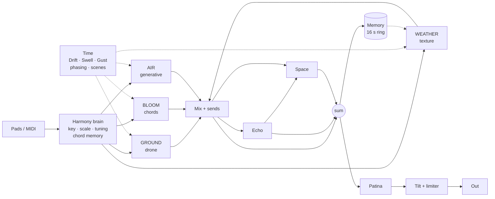

# AmbientForce concept

> **Press one pad, get a landscape.** An instrument for slow music that keeps breathing after you
> stop playing.

Status: concept, 2026-10-06, before the probe. After [Phase 0](#14-roadmap) it becomes
`DESIGN.md` the way EffectForce's did. Numbers marked *est.* are taken from measured sibling
costs. The first device bench replaces them.

- [1. Why a fourth Force](#1-why-a-fourth-force)
- [2. What we take from the hardware, and what we leave](#2-what-we-take-from-the-hardware-and-what-we-leave)
- [3. Pillars](#3-pillars)
- [4. One gesture, four strata](#4-one-gesture-four-strata)
- [5. The strata](#5-the-strata)
- [6. The harmony brain](#6-the-harmony-brain)
- [7. Time](#7-time)
- [8. Space](#8-space)
- [9. On the Force](#9-on-the-force)
- [10. Content](#10-content)
- [11. Budget](#11-budget)
- [12. Reuse map](#12-reuse-map)
- [13. Code layout and tests](#13-code-layout-and-tests)
- [14. Roadmap](#14-roadmap)
- [15. Risks](#15-risks)
- [16. Approaches considered](#16-approaches-considered)
- [17. Decisions](#17-decisions)

---

## 1. Why a fourth Force

| Plugin | Its job | What it deliberately does not do |
|---|---|---|
| PolyForce | Playing parts: 8 voices, wavetables, matrix, arp, sequencers | Effects |
| SubForce | Bass: paraphonic mono, ladder, 2× oversampled | Polyphony, effects |
| EffectForce | Insert rack: Reverb (freeze, shimmer), Grain, Delay, Looper, scenes | Making sound |
| **AmbientForce** | **Time.** Sounds whose main parameter is minutes, not notes | Everything above |

PolyForce into EffectForce makes a good pad. It can't make a landscape that keeps moving with
your hands off the pads, stays in key while it does, and never repeats itself in an hour. That
gap is AmbientForce's whole reason to exist. The rule against scope creep: **if a feature already
exists in a sibling and is not tied to the strata or to long time, it stays in the sibling.**

## 2. What we take from the hardware, and what we leave

| | Sonicware LIVEN Ambient Ø | Sonicware LIVEN Evoke | AmbientForce |
|---|---|---|---|
| Layers | 4 fixed roles: Drone, Pad, Atmos, Noise | 4 sequencer tracks on one engine | 4 roles (**strata**) that all answer **one** MIDI stream |
| Core oscillator | Blendwave: 32 waves × 128 tables; 6 structures incl. ring-mod and FM variants | Acoustronic Flux: 34 instruments sliced into 256 time fragments, scanned back and forth ("Backtide") | **Lifetime oscillator**: 256-frame tables of an instrument's life, computed or sampled by you, coupled to a PolyForce wavetable (Mix / FM / AM / Ring) |
| Texture | Noise layer with 8 s self-sampling | Grain FX, up to 12 grains, pitch harmonised to scales | **Weather**: 16 grains over procedural fields, your WAVs, or the instrument's own **Memory** |
| Harmony | 12-mode arp | 16 chord modes, 13-mode arp | **Harmony brain**: key, scale, just intonation, chords with voice leading, harmonic memory, generative **Air** |
| Time | 64-step sequencers, probability, parameter recording | Same, plus random playback | The Force's sequencer, plus **phasing cycles**, **scene glides** lasting minutes, and **Autopilot** |
| Space | 9 reverbs, tape and reverse delay, chorus, crush, tilt EQ | 10 reverbs incl. the veiled "Mirage" | **Patina → Echo → Space**, reusing EffectForce's FDN and adding a **Haze** voicing. A **tail handoff** gives the feel of endless polyphony |

**Taken:** Ø's role-based layers and its self-sampling noise layer. Evoke's best idea: an
instrument's *lifetime* used as a wavetable axis, scanned back and forth. Its grain pitches
quantised to the scale. Single-pad chords. A veiled reverb voicing.

**Left behind:**
- Their step sequencers and arps. The Force's sequencer is better, and PolyForce has an arp.
- Nine or ten reverb algorithms. One well-tuned FDN with five voicings is enough.
- Crush and overdrive, which belong to EffectForce.
- Their sample ROMs. We never ship third-party samples, so every factory sound is computed and
  the rest comes from you ([10](#10-content)).

**What neither of them does:**
- One gesture drives all four layers.
- Harmonic memory.
- Just-intonation drones whose beating is set in Hz.
- Minutes-long evolution that never realigns.
- An instrument that resamples itself.
- Lifetime tables made from notes you recorded on the Force.

Sonicware's names (Blendwave, Acoustronic, Backtide, Mirage) are theirs. We use our own names and
our own algorithms throughout.

## 3. Pillars

1. **One gesture, a whole landscape.** A single pad drives four strata, and each answers in its
   own way.
2. **Time is the main parameter.** Every motion source reaches cycles of many minutes. The
   default patch does not audibly repeat within 10 minutes.
3. **Always consonant, never static.** Key, scale and tuning are shared by everything. Randomness
   is only ever constrained randomness inside the harmony.
4. **Long tails without the CPU bill.** Sustain comes from Space, Memory and the drone, not from
   40 voices in release.
5. **Force-native.** It plays from the pads and keeps working with no hands on the device. It has
   5 tabs, 16-entry Q-Link sets, MPC automation, and a skin generated from `surface.py` like its
   siblings.

## 4. One gesture, four strata

**What one pad does.** The preset is "Lydian Morning", in D Lydian, and the player presses a
single pad.

1. **Ground** glides over 8 s to D. Its fifth and octave are in just tuning, and its partials
   beat against each other at 0.3 Hz.
2. **Bloom** voices the pad as D–A–E–F♯ spread over three octaves. The notes enter on a 1.5 s
   strum and swell in over 6 s. The voice is a "Felt Piano" lifetime table held at Age 0.7 and
   swaying slowly.
3. **Air** builds a five-note constellation around D Lydian, with glass resonators placing about
   one note every 4 s. Two thirds of them land on chord tones.
4. **Weather** plays rain on a roof, and its grains are pitched to the chord tones. It ducks a
   little while Bloom is loud.

**When the player lets go:**
1. Bloom fades over 12 s and hands its tail to Space.
2. Ground and Air carry on from harmonic memory.
3. Ninety seconds later a **Gust** opens the filters and the grain density for half a minute.
4. Every 4 minutes **Autopilot** glides to a mutated version of the preset over 3 minutes.
5. The next pad pressed moves the whole landscape, including Ground's slow glide, to the new
   harmony.

### 4.1 Who hears your notes: Listen

"Together" doesn't mean "the same". Every stratum has a **Listen** mode, so one gesture works at
four levels of detail:

| Listen | The stratum… | Default for |
|---|---|---|
| Notes | plays what your hands play | Bloom |
| Harmony | follows the harmony memory, not the notes themselves | Ground, Air |
| Free | runs on its own, in key | Weather |
| Off | ignores MIDI (its level still applies) | — |

With the defaults your hands play Bloom and the other three accompany it. Switch Air to Notes and
your hands play glass melodies over drone and rain. The harmony brain is the shared state, and
the strata read it in different ways.

**Split** (off by default): pads below a split note set the harmony and play Bloom; pads above it
play Air directly as melody, whatever Air's Listen mode. On the Force's 8×8 grid that is chords
on the lower rows and melody on the upper rows: two hands, two jobs, one track.

**One track, one MIDI stream.** A plugin is one Force track, so the strata can't take separate
clips from the Force's sequencer, unless MIDI tracks can route into a plugin track on separate
channels ([Phase 0](#14-roadmap)). If they can, a per-stratum MIDI channel (Omni / 1–4) is cheap
to add. Later, instances could share one harmony through the library's shared statics ("Link"):
a stratum per track, each with its own mixer channel and clips. That is not for v0.1.

## 5. The strata

Strata whose level is 0 sleep and cost nothing. Each stratum has its own filter, level, pan, and
Echo and Space sends (on the MIX page).

### 5.1 GROUND: the drone

**One** drone voice per instance, not one per note. That makes it cheap, and it can hold forever.

| Control | Range | Notes |
|---|---|---|
| Source | lifetime table | Same library as Bloom |
| Age, Sway | 0–1; depth and rate | Position in the table, plus slow back-and-forth motion ([5.2](#52-bloom-chords-and-the-lifetime-oscillator)) |
| Root | Chord / Lowest / Tonic | Follow the root of the harmony memory, the lowest held note, or stay on the key's tonic |
| Gravity | 0–30 s | Glide time to a new root. A drone that *leans* into the next chord |
| Partials | Sub, Root, Fifth, Octave, **Color** | Each has its own level. Color picks m3 / M3 / 4th / m7 / 9th / 11th |
| Register | −2 … +1 oct | |
| **Beat** | 0–3 Hz | Detune set in **Hz, not cents**, so the beating rate is the same in every register. In Just tuning the partials are exact ratios, so the only beating is the beating you dial in |
| Breath | 0–1 | Slow swell of level and brightness, driven by the Swell source |
| Cutoff, Body | LP; off → A → O → U | Body is a vowel/formant morph taken from PolyForce's vowel filter. It makes a drone into a choir |

### 5.2 BLOOM: chords and the Lifetime oscillator

Polyphonic, 6 voices ([17](#17-decisions)), unison ≤2, one SVF per voice, with the two
oscillators below.

**The Lifetime oscillator.** A *lifetime table* has 256 single-cycle frames. Each frame is one
moment of an instrument's note, from the attack (frame 0) to the deep tail (frame 255).
- The frames are spaced logarithmically in time. Frames 0–63 cover the first tenth of the note,
  where the sound changes fastest.
- Because each frame is a single band-limited cycle, pitch is free and there is no time-stretch
  smear. The attack transient is lost, which is a feature here: ambient music doesn't want
  attacks.

| Control | Notes |
|---|---|
| Table A | Lifetime table: computed factory table or your own import |
| **Age** | Where in the instrument's life to listen: 0 = just struck, 1 = almost gone |
| **Sway** | Depth, rate and asymmetry of a slow back-and-forth scan around Age. The sound decays and then comes back |
| **Smear** | Fast random micro-motion of Age that makes the spectrum shimmer. Costs nothing, because it only moves the read position |
| Table B | Any PolyForce wavetable, computed or Serum-format |
| Blend | A ↔ B |
| **Couple** | Mix / FM / AM / Ring, with an amount. Our answer to Ø's six structures in one control |
| Breath | Filtered noise layered under the voice, so breath and bow return without a sample |
| Swell / Release | Attack 0–30 s, release 0–30 s; an envelope shaped for slow music |
| Tail | Voice / **Space**: the tail handoff ([8](#8-space)) |

Chords and voicing are set on the HARMONY page ([6](#6-the-harmony-brain)).

### 5.3 AIR: the generative stratum

Air plays sparse melodic particles: glass, bowls, bells, plucks. The harmony decides the pitches,
and the time system decides when they happen. 6 short voices.

- **Sounds:**
  - Glass, Bowl, Bar and Bell: a modal resonator bank with 6 modes per voice, so inharmonic
    sounds stay inharmonic.
  - Kalimba: a Karplus-Strong pluck.
  - Felt: a lifetime table with a short envelope.
- **Density:** 0–60 events a minute, spaced as a Poisson process, so they never fall on a grid
  unless Sync is on.
- **Range:** 0–3 octaves above the chord's register. **Gravity** sets the weight of chord tones
  against other scale tones. The last 2 pitches are never repeated.
- **Pattern:**
  - Random.
  - Rise and Fall.
  - **Constellation:** a motif of 3–8 notes chosen once and replayed with Poisson timing. On each
    pass, *Mutate* swaps one note for a scale neighbour. The melody evolves the way clouds do.
  - **Echo:** the motif is built from the last notes you played.
- **Listen** ([4.1](#41-who-hears-your-notes-listen)):
  - Notes: you play Air directly, one note per key (melody).
  - Harmony: generates from the harmony memory, so it keeps playing after you let go.
  - Free: generates from the key's scale on its own.
- **Loop**, the Airports principle: Air records its own events and repeats them over a loop
  length you set in seconds or bars. Loop lengths combine with the [phasing](#72-phasing)
  ratios, so Air and the other strata keep drifting apart and back.
- **Rubato:** jitter on timing and velocity.

### 5.4 WEATHER: texture and Memory

A 16-grain cloud over one source. The grain engine is EffectForce's Grain (Cloud and Stretch),
plus a **Stream** mode: plain playback with slowly drifting position, for fields that should stay
recognisable.

| Control | Notes |
|---|---|
| Source | **Procedural** factory fields ([10](#10-content)), **your WAVs** from the SSD (≤60 s), or **Memory** |
| Position, Drift, Spray | Where to read, how fast that point wanders, how far grains scatter |
| Size, Grains | 20 ms–2 s; up to 16 |
| Pitch, **To Key** | Semitones, then Off / Scale / Chord. Each grain's pitch is snapped to the harmony, so rain becomes a chord |
| Reverse, Width, Tilt, HP | |
| **Duck** | Weather recedes while Bloom plays and comes back in the gaps |

**Memory.** A rolling 16 s stereo capture of AmbientForce's own output, taken before or after
Space.
- **Remember** freezes the last 16 s and makes them the Weather source. The instrument plays
  *its own past* back to you as weather. This is Ø's self-sampling idea, pointed at the instrument
  itself.
- **Keep** writes the frozen Memory to `ssd:AmbientForce/Memories/Memory NNN.wav`. The write
  happens on the loader thread, never the audio thread. After that the Memory is an ordinary
  source and can be saved with a preset.

## 6. The harmony brain

Everything that has a pitch asks the brain first.

| Control | Options |
|---|---|
| Key | C … B |
| Scale | Major, Minor, Dorian, Lydian, Mixolydian, Phrygian, Maj Pent, Min Pent, Hirajoshi, In-Sen, Whole Tone, Chromatic |
| Tuning | Equal / **Just** (5-limit ratios relative to Key) / Pythagorean / File (`.scl`/`.tun`, from PolyForce) |
| Tune Drift | 0–15 cents: each pitch class wanders slowly and on its own |
| Input | As played / **Snap** (snap to the nearest scale tone) / **Degrees** (C, D, E … play degrees 1, 2, 3 …, so any key or pad is in key) |
| Chord | Off, Triad, Seventh, Sus2, Sus4, Add9, Quartal, Fifths, Cluster, **Spread**. Always diatonic to the scale |
| Voicing, Leading | Close / Open / Drop 2 / Spread. Leading on picks the inversion with the least total movement from the previous chord |
| Strum | 0–2 s: the chord's notes enter one after another |
| Memory | Off / 4–64 bars / Forever: how long the harmony stays "current" after release. Ground and Air follow it |
| Hold | Latch Bloom's chord until the next chord |

**Why Just tuning matters here:** an equal-tempered fifth held for two minutes beats audibly, while
a just fifth (3:2) is still. In ambient music you hear that difference.

## 7. Time

### 7.1 Motion sources

| Source | What it is | Range |
|---|---|---|
| **Drift** | Smoothed random walk | Period 1 s – 20 min |
| **Swell** | A slow asymmetric cycle (default: fast rise, slow fall). The breath of the patch | 2 s – 20 min, or 1–256 bars |
| **Gust** | Rare Poisson events with attack and decay. Sudden swells, like wind | 1 per 10 s – 1 per 30 min |
| LFO 1–2 | Classic shapes | 0.0008 Hz (≈20 min) – 20 Hz, or synced |
| Macro 1–4 | Macro 1 is **HORIZON** | |

Routing goes through an 8-slot matrix (EffectForce's), and every source has a sensible default
destination, so most presets never open the matrix.

**HORIZON** is one knob from *near* (dry, dark, sparse, close) to *far* (wet, bright, dense,
vast). Each preset ships a mapping for it. It is the one control a performer actually rides.

### 7.2 Phasing

Brian Eno's *Music for Airports* uses tape loops of unrelated lengths, so the combination never
comes round twice. Here that is one control: **Phase** sets a base length B, and the main cycle
of each stratum runs at a fixed irrational multiple of B.

| Stratum | Cycle | B = 20 s |
|---|---|---|
| Ground: Swell | B | 20 s |
| Bloom: Sway | B·√2 | 28.3 s |
| Air: Loop | B·φ | 32.4 s |
| Weather: Drift | B·√5 | 44.7 s |

The ratios are irrational, so the four cycles never realign. With Phase off, each cycle is set
on its own.

### 7.3 Scenes, Evolve, Autopilot

- **Scenes** come from EffectForce unchanged: 8 scenes, the Force crossfader as morph, and timed
  moves. One mental model across the family.
- **Evolve** builds a target scene by mutating the current one by *Amount*. Each parameter has a
  mutation range declared in `surface.py`. Structural parameters are never mutated (sources, key,
  scale, chord, voice counts), except that *Evolve Harmony* may move to a related mode or a key a
  fifth away.
- **Autopilot** evolves every N minutes (or on a Gust) and glides there over *Glide* (up to
  10 min).
  - Mutations are always taken **from the preset's own state, never from the last mutation.** It
    is a random walk on a leash, so after 8 hours it still sounds like the preset.
  - This is the installation and sleep-music mode.
- **Fade In and Fade Out** move the master level over 1–64 bars, so a set can start and end with
  no hands.

### 7.4 Hold and Stop

- **Hold** is a toggle tile, following the PolyForce lesson: ignore the bounce revert that
  arrives within 1 s.
- **On Stop:** Keep / **Fade** (8 s, default) / Cut. What MPC sends to an instrument on Stop
  (all-notes-off, suspend) is a [Phase 0](#14-roadmap) question.

## 8. Space

Strata → sends → **Echo** → **Space**. The dry bus, Echo and Space sum, then pass through
**Patina** and a tilt EQ with a limiter.

| Block | Based on | AmbientForce additions |
|---|---|---|
| **Space** | EffectForce Reverb: 8-line FDN, decay to 30 s, freeze, shimmer +12/+7/+19/−12 | Voicings Hall, Plate, Space, **Haze** (extra diffusion, darkening, heavy modulation: veiled and distant) and **Abyss** (near-infinite). **Rise** ducks the wet signal under the input so the reverb blooms *after* the note, using the Delay's ducker |
| **Echo** | EffectForce Delay: tape wow, feedback filters, ducking | Diffuse (smears the repeats into the reverb). Reverse mode after v0.1 |
| **Patina** | EffectForce Drive (not oversampled) and the Delay's wow | Wow, flutter, saturation, hiss and Age (a gentle loss of top end). The whole landscape on old tape |
| Output | | Tilt EQ, a soft limiter at −1 dBFS, and the family's non-finite guard. Freeze + shimmer + feedback must never run away over a long night |

**Tail handoff.** With Tail = Space, a Bloom voice whose release is longer than 1.5 s:
- fades out over 1.5 s,
- while its Space send rises to carry the same energy,
- and the Space decay is held at or above the release time.

The listener hears a 20 s release, but the voice is free again after 1.5 s. The result feels like
endless polyphony from 6 voices. PolyForce's CPU guard, which sheds tails above 40% and 65%, stays
as a second line of defence.

## 9. On the Force

**Identity:**
- Name `AmbientForce`, vendor Devko, uid `AmFc`, file `ambientforce.so`.
- Bundle folder `Devko - VST - AmbientForce`.
- Presets are `.afp` files with the header `ambientforce 1`.
- Environment variables use the prefix `AF_`.
- Skin accent: mist blue `8ab4f8`, next to teal, amber and violet.

**Pages.** MPC shows 5 tabs, so there are 5 tabs, and tapping a tab again cycles through its
sub-pages. That gives 18 pages.

| Tab | Sub-pages |
|---|---|
| PLAY | **PLAY** · HARMONY · SCENES |
| STRATA | GROUND · BLOOM · AIR · WEATHER |
| MOTION | MOTION (Drift / Swell / Gust / Phase) · LFO · MATRIX · MACROS |
| SPACE | SPACE · ECHO · PATINA · MIX |
| BROWSE | PRESETS · SOURCES · MEMORY |

**The PLAY Q-Link set**, the page you live on:

| | 1 | 2 | 3 | 4 | 5 | 6 | 7 | 8 |
|---|---|---|---|---|---|---|---|---|
| Bank 1 | Horizon | Ground Level | Bloom Level | Air Level | Weather Level | Air Density | Space Mix | Freeze |
| Bank 2 | Hold | Remember | Evolve | Autopilot | Glide Time | Swell Depth | Gust Amount | Fade |

**The stratum pages share one knob layout.** The first 8 Q-Links of GROUND, BLOOM, AIR and
WEATHER are always Level · Tone · Shape · Motion · Density · Echo · Space · Width, each of them
the stratum's own parameter. Switching sub-page switches which stratum your hands are on, and
muscle memory carries over. There is deliberately **no "Focus" selector** that retargets one set
of knobs: MPC records automation per parameter, so a knob whose meaning depends on another
setting would play back onto the wrong stratum (EffectForce's rule against generic slots).
Each stratum also has a **Mute** tile, and there is one **Solo**, for arranging live.

- **Crossfader:** scene morph, as in EffectForce.
- **Pads:**
  - With the Force's pads in a scale mode, set Input to As played.
  - With chromatic pads or a keyboard, Input = Snap or Degrees puts every pad in key.
  - Velocity scales each stratum's response.

**Sky view.** Skins can't draw, so like PolyForce's wave view the PLAY page fakes a display with
pushed meter filmstrips. It has about 20 meters, against PolyForce's 48:
- 12 pitch-class lamps: the scale is dim and the current harmony memory is bright, so you can see
  what is "in the air".
- 4 strata activity bars.
- Memory fill.
- Scene glide progress.
- Autopilot countdown.

**Source pickers** are steppers whose display text is the file name, as in PolyForce's table
browser. They are keyed `builtin:`, `plugin:` or `ssd:`, never by index.

**Known limits, accepted:**
- MIDI out is dropped by the host, so Air's notes can't drive other tracks.
- Only the first stereo pair is heard, so strata can't go to separate Force tracks.

## 10. Content

**Every factory sound is computed. No sample data ships**, which follows the family rule against
third-party content. It also keeps the `.so` small.

- **Lifetime tables:** 24 at v0.1, rendered on the loader thread from additive *life models*. Each
  harmonic gets its own decay, beating, brightness curve and formant path over 256 frames. For
  example:
  - Felt Piano, Celesta, Glass Harmonica, Bowed Glass
  - Cello Tasto, Choir Ah→Oo, Reed Organ, Harmonium
  - Flute Breath, Distant Horn, Tape Strings, Sine Bloom (pure → rich)

  This is the same "compute lazily at load" pattern that took PolyForce's startup from 163 ms to
  42 ms.
- **Weather fields:** 12 at v0.1, rendered from procedural models:
  - Rain on Roof, Light Rain, Wind High, Wind Low
  - Surf, Stream, Embers, Vinyl Dust
  - Tape Hiss, Room Tone, Night (FM crickets), Distant City
- **Your own sounds:**
  - `ssd:AmbientForce/Lifetime/*.wav` becomes a lifetime table. The importer runs on the loader
    thread: YIN pitch detection on the sustained part, then 256 log-spaced slices, then single
    cycles, then band-limited mips, then a 16-bit table. Unpitched audio is flagged and offered
    as a Weather source instead. **Record a note on the Force's own sampler, drop it in the
    folder, and it becomes a Bloom voice.**
  - `ssd:AmbientForce/Weather/*.wav` becomes a Weather source.
  - `Memories/` is written by Keep.
- **Presets:** 64 at v0.1, 8 categories × 8: Drones, Beds, Blooms, Choirs, Glass, Weather,
  Memory, Autopilot. Loudness is matched to the family at −16 LUFS over 60 s with peaks under
  −1 dBFS. Some names:

  | Preset | Recipe |
  |---|---|
  | Harbour at 4am | Ground on Tonic with Body O, Weather Surf in Stream, Air Bell at 2/min, Space Haze |
  | First Snow | Celesta Bloom at Age 0.85, Air Glass Constellation, Weather Light Rain *To Key: Chord* |
  | Cathedral Breath | Choir Ah→Oo with Sway at B·√2, Ground with the 5th in Just, Space Abyss with shimmer +12 |
  | Tape Memory | Felt Piano into heavy Patina, Memory post-Space, Remember on Gust |
  | Sleep Cycle | Autopilot every 6 min with Glide 4 min, Fade In over 32 bars, Horizon mapped to darkness |
  | Lantern Choir | Bloom Spread chords with Strum 1.2 s, Air Echo pattern, Ground Gravity 20 s |

## 11. Budget

**CPU, p99 per instance**, gate 15% of the 2902 µs block. All figures *est.* from measured
siblings:

| Block | Load | Basis | Target |
|---|---|---|---|
| Bloom | 6 voices, 2 oscillators, unison ≤2, 1 SVF | PolyForce 8×1 = 5.3%, 8×4 = 7.7% | 4.0% |
| Ground | 1 voice, 5 partials | PolyForce 1×1 = 1.7% incl. fixed cost | 0.8% |
| Air | 6 voices × 6 modes | new; 36 two-pole resonators | 1.0% |
| Weather | 16 grains | EffectForce Grain 2.73% | 2.2% |
| Space | FDN-8, shimmer on | Reverb 3.20%, shimmer ≤1% more | 3.8% |
| Echo | | Delay 1.42% | 1.0% |
| Patina + output | | Drive 1.79%, oversampled, which Patina isn't | 0.5% |
| Brain, time, meters, idle | | EffectForce idle 0.58% | 0.6% |
| **Worst case, everything on** | | | **13.9%** |

**This is tight on purpose. EffectForce's all-on run cost more than the sum of its parts.** The
mitigations are:
- 32-sample control chunks and 4-voice NEON blocks, as in PolyForce.
- Sleeping strata.
- The tail handoff.
- The CPU guard.

If the bench disagrees, the caps fall in this order: Bloom unison 2 → 1, then Air 6 → 4 voices,
then Weather 16 → 12 grains.

**Memory per instance**, out of about 1.1 GB free:

| Item | Size |
|---|---|
| Lifetime tables in use, ≤3 × 4.5 MB, in a shared LRU cache across instances | ≤13.5 MB |
| Weather source, ≤60 s stereo at 16 bit | ≤10.6 MB |
| Memory ring, 16 s stereo float | 5.6 MB |
| Echo, Space and grain state | ~4 MB |
| **Total** | **~35 MB** |

CPU, not RAM, limits how many instances you can run.

## 12. Reuse map

About 60% of the DSP already exists. New work is concentrated where AmbientForce differs.

| From | Taken |
|---|---|
| PolyForce | Wavetable oscillator and LRU table cache; loader thread with epoch graveyard; Serum import (the base for lifetime import); 4-voice NEON engine and CPU guard; vowel filter; `.scl`/`.tun` tuning; the `surface.py` pattern |
| SubForce | The plugin shell lineage and the preset system |
| EffectForce | Reverb (FDN, freeze, shimmer); Grain (Cloud, Stretch); Delay (wow, ducking); Drive; macros, 8-slot matrix, scenes, moves and crossfader; the probe method |
| **New** | Harmony brain; Ground partial engine; lifetime scanning and import; Air modal bank and generator; procedural Weather fields; Memory; phasing; Evolve and Autopilot; tail handoff; Sky view |

Code is copied into `dsp/` with a provenance header (sibling and commit), the same way EffectForce
took SubForce's plugin side. Pulling the shared code into a common library is a separate decision,
for later.

## 13. Code layout and tests

The layout is the family's: `dsp/` (no VST, files or threads), `plugin/`, `surface/`, `presets/`,
`test/` with the fake MPC `host.h`, `tools/`, and `third_party/mpc-vst-plugins`. The tests below
are new ones, specific to AmbientForce.

| Test | Checks |
|---|---|
| `harmony` | Snap and Degrees mapping. Chords stay diatonic in all 12 scales. Leading picks the inversion with the least total movement. Just ratios exact to 0.01 cent |
| `air` | Under `AF_FIXED_SEED`, the same seed gives the same events. Gravity 1 gives only chord tones. No pitch repeats within 2. Density matches its rate within ±10% over 10 min |
| `lifetime` | Import: pitch within ±5 cents on generated test tones. Frames band-limited per mip. Unpitched input rejected |
| **`soak`** | Renders **24 h** offline on x86, about 15 min of wall time, with Autopilot, Freeze, shimmer and Echo feedback all on. No non-finite samples, \|DC\| < −60 dB, peaks ≤ −1 dBFS, loudness drift within ±3 LU of the preset |
| `clock` | Song position and sample counters near 2³¹ and 2³². A 32-bit sample counter wraps after 27 h, and installations run that long (the PolyForce hang lesson) |
| `bench-device` | The [11](#11-budget) budget table, per stratum and worst case |

## 14. Roadmap

| Step | Contents | Gate |
|---|---|---|
| **Phase 0: probe** | On the device, for an instrument: what Stop sends (all-notes-off? suspend?); CC64 and Force pad latch behaviour; whether MIDI tracks can route into a plugin track on separate channels; learning the crossfader on an instrument track; the plugin writing a WAV to the SSD; two instances at once; how fast a lifetime table computes on the A17. Folded into M1's first device run: the M1 build traces what it receives | `PROBE.md` written, then `DESIGN.md` |
| **M1: First light** | Harmony brain, Ground, Bloom with the lifetime oscillator and computed tables, Space with Haze; pages PLAY, HARMONY, GROUND, BLOOM, SPACE, MIX and PRESETS; 16 presets | Playable on the device; Bloom 6×2 + Ground + Space ≤15% p99 |
| **M2: Weather** | Air (modal, pluck, patterns, Loop); Weather (procedural fields, your WAVs, Memory, Keep); Echo; 32 presets | Worst case ≤15% p99; `soak` passes |
| **M3: Long time** | Drift, Swell, Gust, LFOs, matrix, macros, HORIZON; Phase; scenes with Evolve and Autopilot; Patina; Sky view; lifetime import | Hands off for an hour without a dull minute (a listening session) |
| **M4: v0.1** | 64 presets, 24 tables, 12 fields; USER_GUIDE; parameter list frozen and append-only from here; CI release | `tested.json` entry |

## 15. Risks

| Risk | Answer |
|---|---|
| CPU over 15% with everything on | Caps in a set order ([11](#11-budget)), the tail handoff, the guard. Measured from M1 on, not at the end |
| Air sounds random and cheesy | Gravity, Constellation and Mutate instead of pure random; low default Density; listening sessions at each milestone |
| Lifetime frames lose inharmonic character | That is why bells and bars live in Air's modal bank. Lifetime tables are for harmonic sources, and the importer flags anything else |
| Pitch detection fails on your WAVs | Manual root-note override; fallback to Weather |
| Long-run instability (feedback, freeze, denormals over hours) | Limiter, non-finite guard, FTZ, `soak` |
| Counter wrap during installations | 64-bit time everywhere; `clock` test |
| Turning into PolyForce plus EffectForce | The scope rule in [1](#1-why-a-fourth-force) |
| Looking like a Sonicware clone | Our own names and algorithms; the shared ideas (role layers, scanning an instrument's lifetime) are general concepts, and none of their data or code is used |

## 16. Approaches considered

| | Approach | Verdict |
|---|---|---|
| **A** | **Four strata, one gesture**: role layers with a harmony brain and long time | **Chosen.** Only this one does what no sibling does |
| B | One deep voice: lifetime oscillator + grain + reverb, Evoke-style | Fastest to build, but it is "PolyForce with a new oscillator". The lifetime oscillator may go back into PolyForce later anyway |
| C | Texture box: granular fields and a looper, Ø's noise layer grown up | EffectForce's Grain and Looper already cover about 70% of it |

## 17. Decisions

Taken 2026-10-06, when the build started:

1. **Space, Echo and Patina are built in**, reusing EffectForce's code. The tail handoff, Memory
   and complete presets all need Space inside the instrument.
2. **Memory is kept as an SSD WAV** (Keep), not inside the project chunk (5.6 MB per instance per
   save).
3. **Stop fades** over 8 s by default (On Stop: Keep / Fade / Cut).
4. **Bloom has 6 voices.** 8 would cost about +1.3% p99.
5. **Listen modes per stratum**, defaults Bloom = Notes, Ground and Air = Harmony, Weather = Free;
   Split off by default ([4.1](#41-who-hears-your-notes-listen)).
6. **No Focus selector**; the stratum pages share one knob layout instead ([9](#9-on-the-force)).
7. **Product names of the hardware stay in §2 of this document only**: code comments and user
   docs describe AmbientForce on its own terms, as SubForce's docs do.
