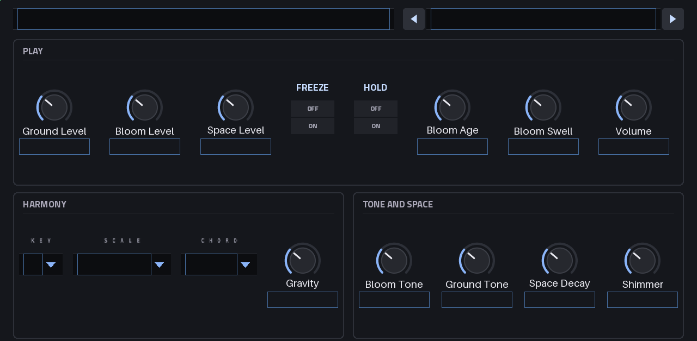
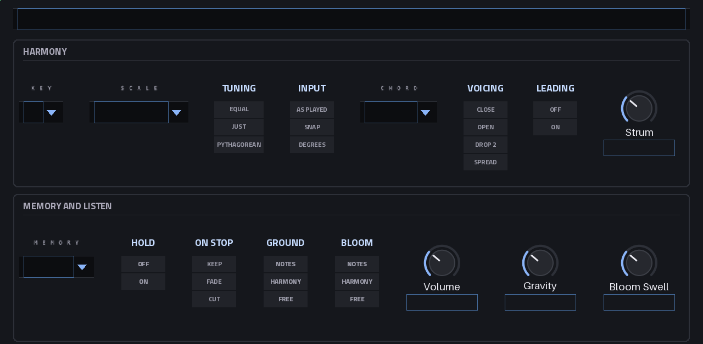
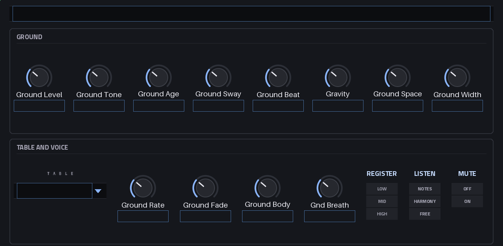
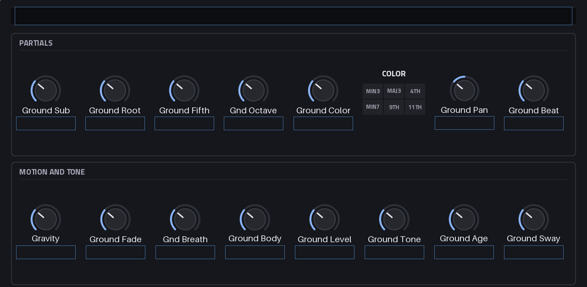
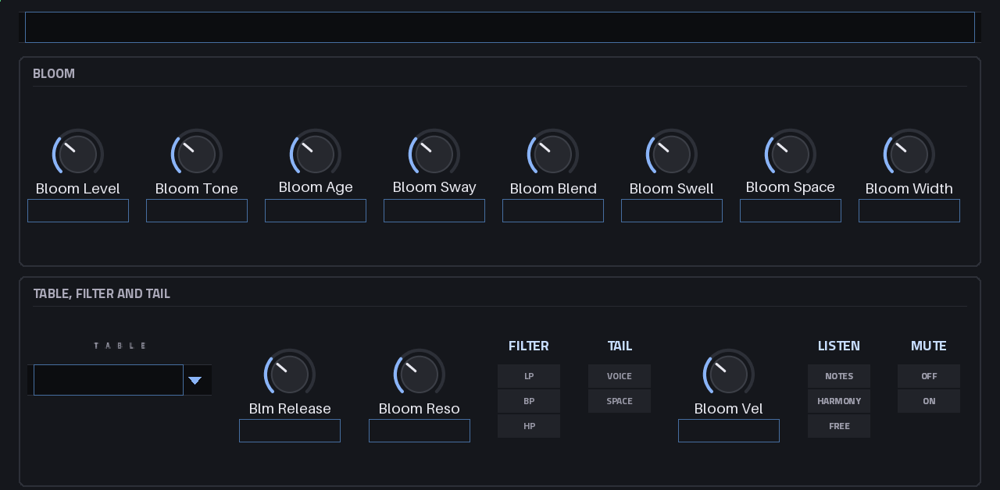
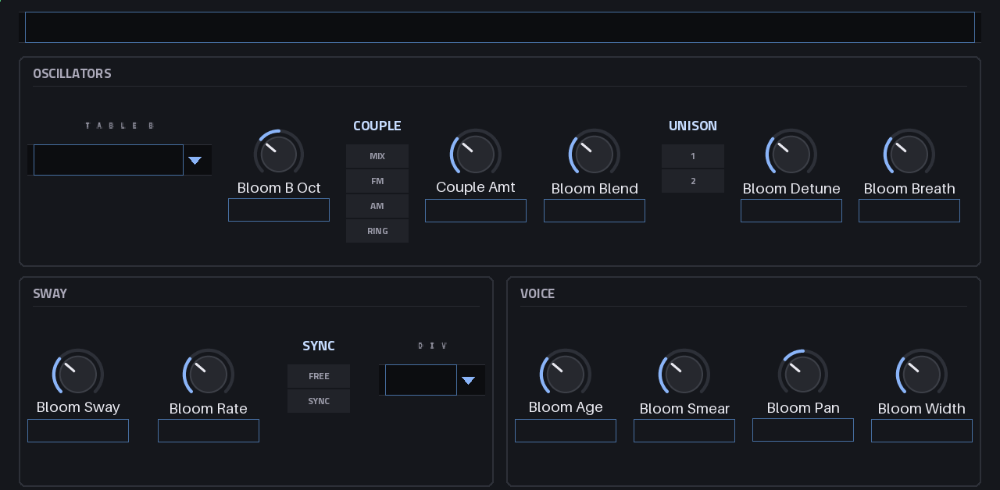
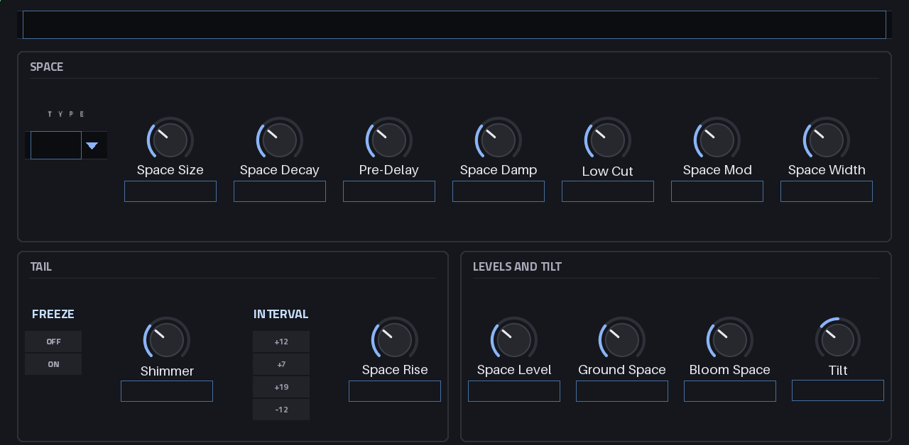
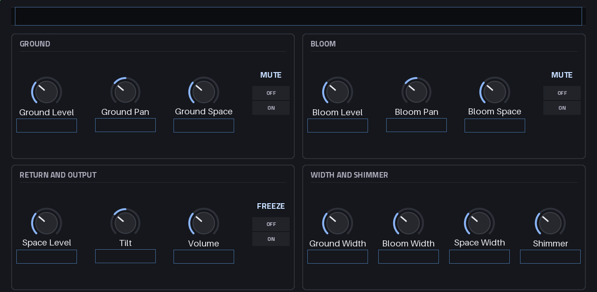

# User guide

- [Getting started](#getting-started)
- [One gesture, several strata](#one-gesture-several-strata)
- [The screen](#the-screen)
- [The macros](#the-macros)
- [The harmony](#the-harmony)
- [Ground, the drone](#ground-the-drone)
- [Bloom, the chords](#bloom-the-chords)
- [Space](#space)
- [Mix and output](#mix-and-output)
- [Presets](#presets)
- [How it behaves in MPC](#how-it-behaves-in-mpc)

---

## Getting started

1. Install it (`make plugin-install`, or a release zip's `install.sh`; both restart MPC).
2. On a track, add **AmbientForce** from MPC's instrument plugins.
3. Open its screen: the **PLAY** page. Init is in C Major, tuned Just, with Input on Snap, so every
   pad is in key.
4. Press one pad and hold it. **Bloom** plays a chord on it (an open triad) that swells in over
   2.5 s; **Ground** fades in a drone on the chord's root under it, over 4 s; both go into **Space**,
   a slow hall.
5. Let go. Bloom releases over 6 s and hands its tail to Space; Ground keeps the drone, because the
   harmony remembers the chord (Memory: Forever). The next pad moves both to its chord, Ground
   gliding there over 6 s (Gravity). When MPC's transport stops, everything fades out over 8 s
   (On Stop: Fade).

Then pick a factory preset (the **PRESETS** page, or the preset stepper at the top of PLAY): the status
line at the top says what it is. Or turn the four **macros** at the top left of PLAY, Horizon, Motion,
Glow and Density, which bend whatever preset is loaded ([below](#the-macros)), or Bloom's **Age** and
hear the same chord at another moment of the instrument's life. Whatever you turn, the status line
says what it does for a few seconds.

## One gesture, several strata

AmbientForce is built from layers of sound, the **strata**, that all answer one MIDI stream. A key
goes to the **harmony brain** first (key, scale, tuning, chord, memory), and every stratum then
hears it in its own way. M1 has two strata; Air (generative melody) and Weather (texture) come in
M2 ([Roadmap](ROADMAP.md)).

| Stratum | What it is | Listens by default |
|---|---|---|
| **Ground** | The drone: one voice of five partials, not one per note, so it can hold forever | Harmony |
| **Bloom** | The chords: six voices over lifetime tables, with long swells and releases | Notes |

Each stratum's **Listen** decides what it follows:

| Listen | Ground | Bloom |
|---|---|---|
| **Notes** | The lowest note you hold; it fades out when no key is down | The chord on each key you play, for as long as you hold it |
| **Harmony** | The root of the harmony's chord, held for as long as the memory keeps it | Moves to the harmony's chord whenever it changes and holds it after you let go; lets go when the memory forgets it |
| **Free** | The key's tonic, from the first note on, whatever you play | The tonic chord (the Chord type on the key's tonic; a triad under Chord Off), from the first note on |

With the defaults your hands play Bloom and Ground accompanies it. Set Bloom to Harmony and your
hands set the harmony instead: Bloom moves to each new chord, the notes the two chords share
sounding on untouched, and keeps holding it with your hands off the pads. Set Ground to Notes and
the drone follows your lowest finger.

Listen can change while the landscape sounds. Ground takes its new target at once, gliding there by
Gravity (or fading out, when the new mode has nothing for it yet). Bloom switched to Harmony or Free
moves to that chord at once, the notes in common sounding on; switched back to Notes, the keys still
held (by a finger, the pedal or Hold) play their chords again before the old chord lets go, so Bloom
and Ground agree.

Nothing sounds before the first note-on, Free strata included. From then on the instrument is
**awake** until a Stop (with On Stop at Fade or Cut) or CC 120 puts it to sleep; letting go of the
keys doesn't. Silence is the
**Mute** switch's job, not Listen's: a muted stratum costs next to nothing.

## The screen

Four tabs; a tab with several pages shows dots under it, and a tap on it again shows the next page.
Every page has its own Q-Link set, named after the page (MPC shows the name in the tab strip): the
Force's first 8 knobs reach the page's top card, the next bank its bottom card, in the order they
stand on the screen.

| Tab | Pages |
|---|---|
| PLAY | **PLAY**: the four [macros](#the-macros), Freeze, Hold, Bloom's Age, the volume; then the levels and Bloom's Swell, the key, scale, chord and Gravity. The preset stepper at the top. **HARMONY**: the harmony brain; its memory, Hold, On Stop and each stratum's Listen |
| STRATA | **GROUND**: the drone's main controls; its table, motion and voice. **DRONE**: its five partials, pan and beating; its breath and sway, free or on the bar. **BLOOM**: the chord voices' main controls; table, release, filter, tail. **BLOOM OSC**: Table B, Couple, Blend, unison, breath; the sway, free or on the bar; the voice's age, smear, pan and width |
| SPACE | **SPACE**: the reverb; its tail (Freeze, Shimmer, Rise); the return, the sends and the tilt. **MIX**: each stratum's level, pan, send and mute; the return, tilt, volume, Freeze; the widths and Shimmer |
| BROWSE | **PRESETS**: the preset browser |

GROUND and BLOOM share the layout of their first bank, so switching page switches which stratum
your hands are on: **Level, Tone, Age, Sway**, then each one's character (Ground's **Beat**,
Bloom's **Blend**), its time (**Gravity**, **Swell**), its **Space** send and its **Width**.

The status line at the top of every page: `VOICES 4   CPU 6%   PEAK 9%`. VOICES counts Bloom's
voices in use and Ground while it sounds; CPU is AmbientForce's share of MPC's audio block over the
last half second, PEAK its slowest block in that time.

**The status line also says what you just did.** Move any control and for 4 s it shows that
control's help, what it does and what its range means: `BLOOM AGE: where in a note's life you
listen, struck to fading`. Load a preset (a tile, the stepper, NEXT, RND, INIT) and for 6 s it shows
the preset's name and description: `HARBOUR AT 4AM: a held G drone in fog, chords drift in`. Then it
goes back to the meter.

- A control you keep moving keeps its line: 4 s from its last move.
- Another control takes the line over once the one shown has had half a second, so automation that
  moves several controls at once doesn't make it flicker.
- Only moves count. MPC sending a control's own value back, a preset or a project loading, and the
  plugin's own steps change nothing there.

Every control's name says what it belongs to ("Ground Tone", "Bloom Swell"), because MPC's Q-Link
overlay shows the name without the page; a few are shortened to fit MPC's name box (Gnd Octave,
Gnd Breath, Blm Release, Couple Amt). Long lists (Key, Scale, Chord, Memory, the tables, Space Type)
are popups: tap the field to pick from the list. Short ones are segments. Every list moves exactly
one option per Q-Link detent or data-wheel click.

The pages, rendered offline from the skin (on the device MPC fills in the names, values and chosen
options):

| | |
|---|---|
|  **PLAY** |  **HARMONY** |
|  **GROUND** |  **DRONE** |
|  **BLOOM** |  **BLOOM OSC** |
|  **SPACE** |  **MIX** |

The Q-Link sets:

| Page | Q-Links 1–8 | Q-Links 9–16 |
|---|---|---|
| PLAY | Horizon, Motion, Glow, Density, Freeze, Hold, Bloom Age, Volume | Ground Level, Bloom Level, Space Level, Bloom Swell, Key, Scale, Chord, Gravity |
| HARMONY | Key, Scale, Tuning, Input, Chord, Voicing, Leading, Strum | Memory, Hold, On Stop, Ground Listen, Bloom Listen, Volume, Gravity, Bloom Swell |
| GROUND | Ground Level, Ground Tone, Ground Age, Ground Sway, Ground Beat, Gravity, Ground Space, Ground Width | Ground Table, Ground Rate, Ground Fade, Ground Body, Gnd Breath, Ground Reg, Ground Listen, Ground Mute |
| DRONE | Ground Sub, Ground Root, Ground Fifth, Gnd Octave, Ground Color, Color Int, Ground Pan, Ground Beat | Gnd Breath, Breath Rate, Breath Sync, Breath Div, Ground Sway, Ground Rate, Gnd Rate Sync, Gnd Rate Div |
| BLOOM | Bloom Level, Bloom Tone, Bloom Age, Bloom Sway, Bloom Blend, Bloom Swell, Bloom Space, Bloom Width | Bloom Table, Blm Release, Bloom Reso, Bloom Filter, Bloom Tail, Bloom Vel, Bloom Listen, Bloom Mute |
| BLOOM OSC | Bloom Table B, Bloom B Oct, Bloom Couple, Couple Amt, Bloom Blend, Bloom Unison, Bloom Detune, Bloom Breath | Bloom Sway, Bloom Rate, Blm Rate Sync, Blm Rate Div, Bloom Age, Bloom Smear, Bloom Pan, Bloom Width |
| SPACE | Space Type, Space Size, Space Decay, Pre-Delay, Space Damp, Low Cut, Space Mod, Space Width | Freeze, Shimmer, Shimmer Int, Space Rise, Space Level, Ground Space, Bloom Space, Tilt |
| MIX | Ground Level, Ground Pan, Ground Space, Ground Mute, Bloom Level, Bloom Pan, Bloom Space, Bloom Mute | Space Level, Tilt, Volume, Freeze, Ground Width, Bloom Width, Space Width, Shimmer |
| PRESETS | Preset, Horizon, Motion, Glow, Density, Bloom Age, Freeze, Volume | Key, Scale, Chord, Gravity, Ground Level, Bloom Level, Space Level, Bloom Swell |

## The macros

Four knobs at the top left of PLAY (and Q-Links 2–5 on PRESETS, to bend a preset while you audition
it) each move several controls at once in one musical direction. They bend the sound the other
knobs make without moving those knobs: with Glow up, Bloom Tone still reads 5.00 kHz, and sounds
brighter. Each runs from −100% to +100%, and at **0 the preset plays exactly as saved**. They are
saved with the sound like any other control; the factory presets keep them at 0.

| Macro | −100% | +100% |
|---|---|---|
| **Horizon** | Near: dry, close, a short room | Far: wet, darker, a long space that blooms after the note |
| **Motion** | Still: the tables held at their Age, the drone without beating or breath | Moving: deep, faster sways, the tone flickering, the drone breathing and beating |
| **Glow** | Dark and warm | Bright and airy, with a shimmer |
| **Density** | Sparse: the drone's root and fifth alone, the chords' notes one by one | Thick: the drone's other partials up, a wider unison, more breath, the chords all at once |

What each one moves (h, m, g, d: the macro from −1 to +1):

| Macro | Moves |
|---|---|
| **Horizon** | Ground Space and Bloom Space × 2^(1.5 h) near (to −9 dB), × 2^(0.5 h) far (to +3 dB); Space Level near only, × 2^(0.5 h) (to −3 dB); Ground Level and Bloom Level far only, × 2^(−0.5 h) (to −3 dB); Space Decay × 2^(1.3 h) (0.41× to 2.46×); Pre-Delay + 50 ms × h; Ground Tone, Bloom Tone and Space Damp × 2^(−0.5 h) (half an octave brighter near, darker far); Space Rise toward 0 near, 60% of the way to 100% far |
| **Motion** | Ground Sway and Bloom Sway toward 0, or 80% of the way to 100%; Ground Rate, Bloom Rate and Breath Rate × 2^(2 m) (a quarter to four times as fast; a cycle synced to the bar keeps its division); Bloom Smear toward 0, or 60% of the way to 100%; Gnd Breath toward 0, or 70% of the way to 100%; Ground Beat to 0 still, × 2^(1.5 m) moving (at most 3 Hz) |
| **Glow** | Ground Tone and Bloom Tone × 2^(2 g) (two octaves either way); Tilt + 30 points × g; Space Damp × 2^g; Shimmer + 35 points × g, bright only (not with Shimmer Int at −12, which darkens); Ground Body × 2^(−g) (twice as much, darker vowels, toward dark; half toward bright); the volume down 1.5 dB × (−g), dark only |
| **Density** | Ground Sub, Gnd Octave and Ground Color × (1 + d) sparse (to 0), × 2^d thick (Root and Fifth stay); Bloom Detune and Bloom Breath likewise (no detune: unison 2 plays as one voice); Strum × 2^(−d) + 0.6 s × (−d) sparse (one note after another even from 0), × (1 − 0.75 d) thick (a quarter); the volume down 1 dB × d, thick only |

- Every result stays inside its control's range, and what a preset has switched off stays off (a
  send or the Space Level at 0, a partial at 0, Body off, no Beat), Shimmer aside: Glow's bright half
  adds one (unless the preset's shimmer goes down).
- Two macros can move one control (Horizon and Glow both move the Tones and Space Damp); each adds
  its share.
- The level stays near the preset's: far is a few LU quieter (the dry steps back), dark and thick are
  trimmed by the volume. No macro at either end drives a factory preset into the limiter.
- Nothing that would jump is touched: not Unison, the chord, the voicing or the tables.

## The harmony

Everything that has a pitch asks the harmony brain first. Its controls are on the HARMONY page:

| Control | Options | Init |
|---|---|---|
| **Key** | C … B: the tonic | C |
| **Scale** | Major, Minor, Dorian, Lydian, Mixolydian, Phrygian, Maj Pent, Min Pent, Hirajoshi, In-Sen, Whole Tone, Chromatic | Major |
| **Tuning** | Equal, Just, Pythagorean | Just |
| **Input** | As Played, Snap, Degrees | Snap |
| **Chord** | Off, Triad, Seventh, Sus2, Sus4, Add9, Quartal, Fifths, Cluster, Spread | Triad |
| **Voicing** | Close, Open, Drop 2, Spread | Open |
| **Leading** | Off, On | On |
| **Strum** | 0–2 s | 0 |
| **Memory** | Off, 1, 2, 4, 8, 16, 32 or 64 Bars, Forever | Forever |
| **Hold** | Off, On | Off |
| **On Stop** | Keep, Fade, Cut ([below](#stop)) | Fade |

### Tuning

- **Equal**: the twelve equal semitones.
- **Just**: 5-limit ratios over the key's tonic: 1, 16/15, 9/8, 6/5, 5/4, 4/3, 45/32, 3/2, 8/5,
  5/3, 9/5, 15/8. The tonic stays where Equal has it.
- **Pythagorean**: everything from stacked pure fifths (3/2), so the fifths are pure and the thirds
  bright.

**Why Just matters here:** an equal-tempered fifth held for two minutes beats audibly, about once
a second in the middle of the keyboard; a just fifth (3:2) is still. In music that holds a chord
for minutes you hear that difference. Under Just, Ground's partials are exact ratios over its own
root, so the only beating in the drone is the beating you dial in with **Beat**. Bloom's notes are
just relative to the *key*: on a chord off the tonic (ii, vi) Ground's fifth or third can sit a
comma (about 21 cents) away from Bloom's note of the same name, a slow shimmer between the two
strata.

### Input

What a key becomes before anything plays it:

- **As Played**: the note itself. Use it with the Force's pads in a scale mode, or to play outside
  the scale on purpose.
- **Snap**: the nearest tone of the scale; between two, the lower one. In D Major, C (60) plays B
  (59) and D# (63) plays D (62).
- **Degrees**: the white keys play the scale's degrees, so every key and every pad is in key. C4
  (60) plays the tonic in that octave (60 + Key), D4 the second degree, and so on; a black key plays
  the white key below it. In D Major: 60 → D, 62 → E, 64 → F#. A scale with fewer than seven tones
  runs on into the next octave (C Min Pent: C D E F G A B play C Eb F G Bb C Eb). Under Chromatic,
  every key plays as played, moved up by the key.

Under Snap and Degrees two keys can map to one note (Degrees: C and C# both play the tonic). The
harmony keeps the keys apart: the note sounds until both keys are up.

### Chord

With a chord type, every key plays a chord on its (mapped) note, stacked from the scale's own
degrees, so it is always **diatonic**: in C Major, D plays D minor (D F A), G plays G major. Chromatic
has no chords of its own and borrows the major scale on the root. A root outside the scale (As
Played, off the scale) gets a **parallel** chord: the stack of the degree below it, moved up to
it (C# in C Major plays C# F G#).

| Chord | On C in C Major, Close |
|---|---|
| Off | The note alone (with several keys down, the notes held, as played) |
| Triad | C E G |
| Seventh | C E G B |
| Sus2 / Sus4 | C D G / C F G |
| Add9 | C E G D (an octave up) |
| Quartal | C F B (stacked fourths of the scale) |
| Fifths | C G D |
| Cluster | C D E |
| Spread | The triad's tones, always voiced Spread |

On Notes, **every key plays its own chord**: two keys, two chords, the notes they share sounding
once. For one chord at a time, play one key at a time; to play the chord yourself, set Chord to Off.

### Voicing and Leading

How a chord's tones are placed, for C major on C4:

| Voicing | Rule | C major |
|---|---|---|
| **Close** | The stack as it is | C4 E4 G4 |
| **Open** | Every second tone up an octave | C4 G4 E5 |
| **Drop 2** | The second-highest tone of the close voicing an octave down | E3 C4 G4 |
| **Spread** | Root and fifth an octave down, the rest above | C3 G3 E4 G4 |

A voicing has at most six notes (Bloom's six voices), and every chord stays between C1 and C8 (MIDI
24..108), moved there by whole octaves.

**Leading** On picks, among the inversions of the chord and their octave placements, the one whose
notes move least from the chord before, keeping the voicing's shape (Spread never inverts: its root
stays at the bottom). Voiced Close, C (C4 E4 G4) to F becomes C4 F4 A4, not F4 A4 C5; to G it
becomes B3 D4 G4.
Bloom then keeps the shared notes sounding and moves only the others. Leading Off plays every chord
as built.

**Strum** (0–2 s) brings a chord's notes in one after another, lowest first: note k of n starts
k × Strum / (n − 1) later. A note that is already sounding isn't struck again.

### Memory

The harmony's **current chord** is what Ground and Bloom follow in their Harmony modes. A key going
down sets it: the chord on that key (the latest key wins), voice-led from the one before. Keys going
up change nothing until the last one; then the chord stays for **Memory** bars (4/4, at MPC's tempo,
120 BPM when it gives none), **Forever**, or, with **Off**, not at all. Memory turned down later
forgets a chord that is already older than its bars at once. With Chord Off the current chord is
the notes held, as played, the lowest as the root.

The harmony remembers 16 keys. With more held, a new key first lets go the oldest key the pedal or
Hold keeps; sixteen fingers keep theirs, and a seventeenth key still plays Bloom but isn't heard
by the harmony.

### Hold and the pedal

- **Hold** latches what you play. Let go, and the keys stay down for AmbientForce. The first note-on
  after **all** your fingers have left starts the next chord: the latched one lets go once the new
  one has started, so the notes they share carry on. Keys pressed while a finger is still down join
  what is sounding. Turning Hold off lets the latched keys go (to the pedal, if it is down).
- **The sustain pedal** (CC 64) keeps every key let go while it is down until it comes up.
- A key held by the pedal or by Hold still counts as held for the harmony: the memory's bars count
  from when the chord is let go, not from when the fingers left it, and Ground on Notes stays under
  what keeps sounding.

Hold is a segment (Off / On) rather than a tile, so a tap is exactly one change.

## Ground, the drone

One voice per instance, not one per note: cheap, and it can hold forever. What it follows is its
Listen ([above](#one-gesture-several-strata)); everything else is here.

| Control | Range | Init | What it does |
|---|---|---|---|
| Ground Level | 0–100% | 70% | Its level (an audio taper: 70% is −6 dB) |
| Ground Tone | 40 Hz–16 kHz | 2.50 kHz | A gentle low-pass (no resonance) after the partials |
| Ground Table | the [table library](#lifetime-tables) | Cello Tasto | The sound every partial plays |
| Ground Age, Ground Sway, Ground Rate | 0–100%, 0–100%, 0.002–2 Hz | 50%, 30%, 20 s | Where in the table's life, and how it moves ([below](#lifetime-tables)) |
| Gnd Rate Sync, Gnd Rate Div | Free, Sync; 1/4 … 64 Bars | Free, 8 Bars | The sway at Ground Rate, or once a division on the bar ([below](#free-or-on-the-bar)) |
| Ground Beat | 0–3 Hz | 0.30 Hz | How fast the partials beat against each other |
| Gravity | 0–30 s | 6 s | The glide to a new root |
| Ground Fade | 50 ms–30 s | 4 s | Fade in when the drone starts, out when it stops |
| Ground Sub, Root, Fifth, Gnd Octave, Color | 0–100% each | 30, 100, 50, 25, 0% | The five partials' levels |
| Color Int | min3, maj3, 4th, min7, 9th, 11th | 9th | The Color partial's interval |
| Ground Reg | Low, Mid, High | Mid | The octave the root starts in: C1–B1, C2–B2 or C3–B3 |
| Ground Body | 0–100% | 0% | A vowel: off → a → o → u |
| Gnd Breath, Breath Rate | 0–100%, 0.11 s–30.5 min | 30%, 14 s | A slow swell of level and brightness, and how long one takes |
| Breath Sync, Breath Div | Free, Sync; 1/4 … 64 Bars | Free, 8 Bars | The breath at Breath Rate, or once a division on the bar |
| Ground Width, Ground Pan | 0–100%, L100–R100 | 50%, C | The partials' spread, and the drone's place |
| Ground Space | 0–100% | 40% | Its send to Space |
| Ground Listen, Ground Mute | | Harmony, Off | |

### The partials

**Sub** an octave under the root, **Root**, **Fifth**, **Octave** an octave above, and **Color**,
an interval of your choice: all five on Ground's table at one position. Under Just and Pythagorean
the Fifth is a pure 3/2 and Color its tuning's ratio (Just: min3 6/5, maj3 5/4, 4th 4/3, min7 9/5,
9th 9/4, 11th 8/3; Pythagorean: 32/27, 81/64, 4/3, 16/9, 9/4, 8/3); under Equal they are 7 and 3,
4, 5, 10, 14 or 17 semitones. A partial at 0 costs nothing.

### Beat

**Beat** is the rate, in **Hz**, at which Root and Fifth beat where their harmonics meet (Root's
3rd against Fifth's 2nd). Each partial is moved in Hz, not in cents, so the beating runs at the
same rate in every register: a 0.3 Hz shimmer stays a 0.3 Hz shimmer an octave down. The other
partials' meetings beat at nearby rates around it (Sub against Root at 0.2 × Beat, Root against
Octave at 0.3 ×, Fifth against Octave at 1.1 ×), so the drone breathes at a few slow, related
speeds. At Beat 0 under Just it is perfectly still.

### The root and Gravity

Only the target's pitch class counts. From silence the root starts in **Ground Reg**'s octave. A
new root while the drone sounds goes to the nearest octave of its pitch class (B to C rises a
semitone, not eleven), and **Gravity** glides it there: exponentially, 95% of the way after Gravity's
time, a drone that leans into the next chord. Gravity 0 jumps. Changing Ground Reg while it sounds
dips the drone out for 40 ms and brings it back in the new octave, without a glide.

### Fade, Body, Breath, Width

- **Ground Fade**: the drone fades in from −60 dB over Fade when it starts and out the same way when
  it stops (Notes with no key down, the memory forgetting the chord). A new root while it fades out
  turns it round where it is.
- **Ground Body**: two formant filters on a vowel's first two formants, mixed with the drone: up to
  a third of the knob fades in "a", then it moves to "o" and on to "u". It makes a drone into a
  choir, lifting a harmonic on a formant by 4.7 dB at most and keeping the level within 2.5 dB.
- **Gnd Breath**: a sine moves the level by ±3 dB and Ground Tone by ±1 octave, both times Breath:
  one breath per **Breath Rate** (0.11 s to 30.5 min, 14 s by default: from a fast pulse to a tide),
  or, with **Breath Sync** on Sync, one per **Breath Div** on the bar, at its top on each division's
  downbeat ([below](#free-or-on-the-bar)).
- **Ground Width**: Sub stays in the middle, Root and Octave go left, Fifth and Color right.

A new table, or the table's own arrival after the plugin loaded ([below](#lifetime-tables)), fades
in over 20 ms: switching never clicks.

## Bloom, the chords

Six voices. Each is a pair of oscillators over the table library, joined by **Couple**, plus a
breath of noise at the note, one filter and an envelope made for slow music.

| Control | Range | Init |
|---|---|---|
| Bloom Level | 0–100% (audio taper) | 70% |
| Bloom Tone, Bloom Reso, Bloom Filter | 20 Hz–20 kHz; 0–100%; LP, BP, HP | 5.00 kHz, 10%, LP |
| Bloom Table | the table library | Felt Piano |
| Bloom Age, Bloom Sway, Bloom Rate, Bloom Smear | 0–100%; 0–100%; 0.002–2 Hz; 0–100% | 60%, 25%, 14 s, 10% |
| Blm Rate Sync, Blm Rate Div | Free, Sync; 1/4 … 64 Bars | Free, 8 Bars |
| Bloom Table B, Bloom B Oct | the table library; −2..+2 octaves | Sine, 0 Oct |
| Bloom Blend | 0–100% (A to B) | 0% |
| Bloom Couple, Couple Amt | Mix, FM, AM, Ring; 0–100% | Mix, 0% |
| Bloom Unison, Bloom Detune | 1, 2; 0–50 cents | 1, 8 ct |
| Bloom Swell, Blm Release | 5 ms–30 s; 10 ms–30 s | 2.50 s, 6.00 s |
| Bloom Vel | 0–100% | 40% |
| Bloom Breath | 0–100% | 5% |
| Bloom Tail | Voice, Space | Space |
| Bloom Width, Bloom Pan | 0–100%; L100–R100 | 60%, C |
| Bloom Space | 0–100% (its send) | 50% |
| Bloom Listen, Bloom Mute | | Notes, Off |

### Lifetime tables

A **lifetime table** is 256 single-cycle frames, each one moment of an instrument's note: frame 0
is the strike, frame 255 the deep tail. The frames are spaced logarithmically in time (the first
quarter of the table covers the first tenth of the note, where the sound changes fastest), and
every frame has the same loudness: a table carries **timbre, not level**, so Age 1 is as loud as
Age 0. Each frame is one band-limited cycle, so the pitch is free and nothing smears; the attack's
transient is gone, which slow music doesn't miss.

- **Age**: where in the life to listen. 0 just struck, 1 almost gone.
- **Sway**: a slow back-and-forth around Age, up to a quarter of the table each way at 100%, at
  **Rate** (0.002–2 Hz; below 1 Hz shown as the time one cycle takes: 20 s, 8.3 min), or synced to
  the bar ([below](#free-or-on-the-bar)). Near an end of the table it turns back rather than
  stopping there. Free, every voice sways on its own phase.
- **Smear** (Bloom only): fast random micro-motion of the position (up to ±3% of the table, a new
  target every 50–200 ms, gliding), so the spectrum shimmers. It costs nothing.

The table library, every one of them computed when the plugin loads (no samples ship):

| Table | Its life |
|---|---|
| Felt Piano | Dark and round from the strike, the 2nd harmonic strong, the upper partials dying first and beating gently; ends near a sine |
| Celesta | A hollow, glassy, odd-heavy ping that loses its overtones within a second, leaving a near-sine |
| Glass Harmonica | Harmonics 1, 2, 3 and 5 only, barely decaying, the overtones beating slowly |
| Cello Tasto | A soft bowed string with a body resonance; the bow's pressure swings the brightness, and the stroke settles darker |
| Choir Ah-Oo | Voices singing "ah" that close to "oo" over the life, every partial beating a little |
| Reed Organ | Reedy and steady, mostly odd harmonics, a little beating between the reeds |
| Sine Bloom | A decay run backwards: a pure sine that grows into a soft saw |
| Tape Strings | A string section on tape: a mellowing saw, every partial gently beating |
| Sine, Triangle, Saw, Square | The digital waves, one frame each (Age and Sway do nothing on them) |

The tables are built on a background thread when the first AmbientForce loads, in this order, and
shared by every instance. Until a table is ready, its slots play a sine, then fade into the table
over 20 ms when it arrives.

### Free or on the bar

Ground's breath and both strata's sways run **Free** by default, each at its own rate knob: cycles of
unrelated lengths that never line up again, which is what keeps a held drone alive for an hour
(phasing, [Concept](CONCEPT.md#72-phasing)). **Sync** (Breath Sync, Gnd Rate Sync, Blm Rate Sync)
runs one cycle per **Div** instead: 1/4 (a quarter note), 1/2, 1 Bar and on to 64 Bars, 4/4.

- While MPC's transport plays, a synced cycle is locked to MPC's position: it is where the bar
  says, after a loop, a jump or a tempo change too. A synced breath is at its top on each
  division's downbeat: Breath Div 1/4 throbs on every beat.
- While it is stopped, a synced cycle runs on at the tempo from where it was, and locks back to the
  bar when MPC plays again (a jump, as it takes up the bar's position).
- Synced, Bloom's six voices sway together, on the bar, instead of each on its own phase.
- The rate knobs stay what Free plays; Sync and Div leave them alone, and the Motion macro bends
  only the free rates.

### Table B and Couple

Each voice reads a second table, **Table B**, at the same position and at **B Oct** octaves from
the note. **Blend** mixes A and B; **Couple** decides how they meet first:

- **Mix**: A and B side by side, by Blend.
- **FM**: B moves A's phase (up to half a cycle at Couple Amt 100%): bells, metal, growl. Then Blend.
- **AM**: B moves A's level, from none at 0% to full at 100%. Then Blend.
- **Ring**: A times B, mixed with A by Couple Amt: sum and difference tones. Then Blend.

At Blend 0 in Mix, B isn't read at all (it costs nothing); at Blend 100% only B plays. Deep FM on
high notes folds some partials back down: FM widens the spectrum beyond what the table's mip level
allows for.

### Unison, the envelope, velocity

- **Unison 2** doubles each voice: two pairs detuned by −Detune/2 and +Detune/2 cents, together as
  loud as one. Under 1 cent of Detune it plays as unison 1 (two halves that close would only comb
  each other). It is the costliest switch on the instrument ([CPU](#cpu)).
- **Swell**: the attack, along an S-curve: half way (−6 dB) at half the time. Up to 30 s.
- **Release**: exponential, −60 dB after Release. Up to 30 s.
- **Vel**: how much velocity sets the level: a gain of 1 − Vel + Vel × velocity (0%: every note
  alike).

### Filter, breath, width

- **Bloom Filter** LP, BP or HP at **Bloom Tone**, with **Bloom Reso** from gentle (Q 0.5) to
  singing (Q 16 at 100%; 10% is Q 0.71, flat).
- **Bloom Breath**: white noise band-passed at each note's pitch, under the voice: the breath or
  bow without a sample. At 100% as loud as the tone.
- **Bloom Width** spreads a chord's notes across the stereo field, lowest to highest, and a voice's
  unison halves around their place.

### Voices

A new note takes a free voice; with none free, the quietest one releasing; else the oldest. A voice
taken from a note fades it out over 3 ms first. A note some voice already sounds isn't doubled: it simply belongs to both
chords and sounds until both keys are up. A note still releasing, pressed again, swells again in
its own voice from where it is.

### The tail handoff

With **Tail: Space** and a Release longer than 1.5 s, a released voice doesn't hold on for the
whole release. Its dry sound fades over 1.5 s while its send to Space carries the same energy into
the reverb as the whole release would have, and the voice is free again: you hear a 20 s release,
but the voice is back after 1.5 s. Six voices then feel like endless polyphony. While Tail is
Space, Space's decay is held at Bloom's Release or longer (in Abyss, which rings four times its
Decay, at a quarter of the Release), so the reverb carries the tail on.

The handoff needs a Space to hand to. Bloom releases as **Tail: Voice** instead (the whole release
in the voice) when Space can't carry the tail: **Space Level** at 0, **Bloom Space** at 0, or
**Freeze** on (a frozen reverb takes nothing in). Turning Bloom Space down to 0 during a handoff
loses that tail.

**Tail: Voice** keeps each voice for its whole release: with long releases and many chords,
voices are stolen sooner.

## Space

The instrument's reverb, as a send and return: each stratum sends to it (Ground Space, Bloom
Space), and **Space Level** sets how much of it comes back. Inside is an 8-line feedback delay
network with modulation, freeze and shimmer.

| Control | Range | Init |
|---|---|---|
| Space Type | Room, Hall, Plate, Space, Haze, Abyss | Hall |
| Space Size | 0–100% | 60% |
| Space Decay | 0.1–30 s | 8.00 s |
| Pre-Delay | 0–250 ms | 30 ms |
| Space Damp | 1–20 kHz | 6.00 kHz |
| Low Cut | 20 Hz–1 kHz | 120 Hz |
| Space Mod, Space Width | 0–100% | 40%, 100% |
| Freeze | Off, On | Off |
| Shimmer, Shimmer Int | 0–100%; +12, +7, +19, −12 | 0%, +12 |
| Space Rise | 0–100% | 20% |
| Space Level | 0–100% (audio taper) | 80% |

**The types:** **Room** (short lines, dense and quick), **Hall** (smooth, a little movement),
**Plate** (the fastest build-up, bright), **Space** (very long lines, slow and deep modulation), and
two for pads that live in the reverb:

- **Haze**: Space's lines, veiled and distant. The strongest diffusion at the input, so nothing
  arrives as an edge; half as much modulation again as Space; and darker, its damping set from half
  of Space Damp.
- **Abyss**: near-endless. Longer lines still, and **four times** the decay asked for: Decay 30 s
  rings for two minutes. It is louder than the other types at the same knobs, by design: its tail
  builds up for that much longer.

Changing the type fades the wet out for a moment and starts the reverb afresh in the new type, as a
hardware reverb's program change does: never a click.

- **Size** scales the lines; a change glides, so a tail in flight bends in pitch a little.
- **Decay** is the time to −60 dB at low and middle frequencies, the same in every type and size
  (Abyss: four times as long). With Bloom's Tail on Space it is held at Bloom's Release or longer
  (Abyss: a quarter of it), so a tail handed off rings on ([above](#the-tail-handoff)).
- **Damp**: above it the tail dies faster, as in a real room (the decay time halves at Damp and keeps
  falling above). **Low Cut** keeps the lows out of the reverb (off at 20 Hz).
- **Mod**: gentle movement in the tail, lusher and never metallic. **Width**: 0 is a mono wet.
- **Freeze** holds the tail for ever and lets nothing new in. While it is on, Bloom releases as Tail
  Voice.
- **Shimmer** sends the tail through a pitch shifter as it circulates, so it blooms upward (or, at
  −12, downward) with every pass. Frozen with shimmer, the tail doesn't hold still: it keeps climbing
  and drains away over tens of seconds; Shimmer 0 freezes for good.
- **Rise** lets the reverb bloom *after* the note: the wet ducks under what is coming in and comes
  up once it stops. At 100% a send at −28 dBFS or louder (a held chord at Init's levels) mutes the
  wet entirely; Ground's drone alone, quieter, ducks it a little over half. Only what you hear
  ducks: the tail builds underneath as it would without Rise, and is there when the note lets go.
  Rise 0 is the plain reverb.
- **Space Level** at 0 switches the sends off too: a Space nobody hears isn't run.

Space runs for as long as its tail lasts: at long decays (Abyss at 30 s for minutes) it keeps
costing CPU after the last note ([CPU](#cpu)).

## Mix and output

The MIX page has every stratum's level, pan, send and mute in one place, then the output.

- **Level**: an audio taper (gain = knob², so 70% is −6 dB and 50% −12 dB), as across the family.
- **Pan**: equal power, unity in the middle. Volume, Space Level and the pans glide to a new value
  over 10 ms, so turning them never clicks.
- **Mute**: a segment; it glides (no click), and a muted stratum costs next to nothing.
- **Tilt** (−100%..+100%): one gentle shelf pivoting at 800 Hz. At +100% the highs are 6 dB up and the
  lows 6 dB down; at −100% the other way; 0 is bypassed.
- **Volume** (−inf..+6 dB) comes **before** the limiter, so the output never passes −1 dBFS at any
  volume. At its default −6 dB, Init plays at −16 LUFS, and the presets are level-matched at −6 dB or
  under; what the 12 dB above them would push past the ceiling, the limiter takes.
- **The limiter**: no lookahead (no latency). It holds peaks at about 0.95 of the ceiling and soft
  clips what its 1 ms attack lets through, up to a ceiling of −1 dBFS that nothing passes.
- **The guard**: should a sample ever come out not finite (it never should), that block is silence
  and every filter and voice starts afresh; the keys and the harmony stay, so the strata following
  the harmony come back by themselves.

## Presets

**28 factory presets**, each in its own key and scale. Drones put Ground forward with Bloom quiet
and following the harmony; Beds use both strata with long swells; Blooms put Bloom forward over a
low Ground; Choirs sing Choir Ah-Oo on both strata, Ground with Body. **Contrasts** each answer
playing in a way the others don't: an instrument for melodies, a bass, a latch pad, a drone that
throbs on the beat, a sound that blooms only after you let go. Each one says what it is on
the status line when it loads (`FIFTH LIGHT: pure fifths on glass, into an endless shimmer`), and
keeps the [macros](#the-macros) at 0.

| Preset | What it is |
|---|---|
| **Templates / Init** | The defaults, level-matched: C Major in Just, Felt Piano triads on the keys over a Cello Tasto drone, into an 8 s hall |
| **Drones / Low Tide Hum** | E Phrygian: a dark Reed Organ drone up front, breathing, with quiet Sine Bloom chords following the harmony, into Space |
| **Drones / Harbour at 4am** | G Minor: a Cello Tasto drone held on the tonic (Free) with a vowel, Celesta sevenths late in their life following the harmony, into Haze |
| **Drones / Fifth Light** | A Mixolydian in Pythagorean tuning: a Sine Bloom drone strong in fifths and octaves under Glass Harmonica fifths, into Abyss with a shimmer a fifth up |
| **Beds / Lydian Morning** | D Lydian: Add9 chords in the Spread voicing, strummed over 1.5 s, on Felt Piano at Age 0.7, over the drone |
| **Beds / Slow Aurora** | F# Major: Sus2 chords spread wide on Sine Bloom in unison 2, following the harmony, swaying over 80 s and swelling over 10 s, into Abyss with shimmer |
| **Beds / Felt Room** | D# Major, equal-tempered: Felt Piano sevenths in Drop 2, the drone on your lowest key, a small room, each release in its own voice |
| **Beds / Night Ferry** | B Minor: a low drone beating fast under dark, resonant Tape Strings in unison 2, into Space with a shimmer an octave down |
| **Blooms / First Snow** | F major pentatonic: strummed Celesta late in its life, shimmering with Smear, over a quiet high sine drone |
| **Blooms / Glass Orchard** | C# Hirajoshi: strummed Glass Harmonica Add9 chords in unison 2, into a plate with a shimmer a twelfth up |
| **Blooms / Tape Bloom** | A# Major, equal-tempered: Tape Strings with a triangle an octave down blended in, wide unison and Smear, into a short plate |
| **Blooms / Sine Garden** | E Dorian: Quartal chords, Close, on Sine Bloom swaying deep, a touch of FM from a sine an octave up |
| **Choirs / Lantern Choir** | G# Major: Spread chords strummed over 1.2 s on Choir Ah-Oo in unison 2, the choir drone leaning into each chord over 20 s |
| **Choirs / Distant Ah** | F Minor: the choir held at its "ah", wide unison, far back in Haze behind a long pre-delay and Rise |
| **Choirs / Cathedral Breath** | C Dorian: the choir in the Spread voicing, swaying over 28 s, over a choir drone with a strong just fifth and Body, into Abyss with shimmer |
| **Choirs / Choir in Haze** | F# minor pentatonic: the choir drone up front, its vowel towards "u", choir chords late in their life in wide unison, deep in Haze |
| **Contrasts / Felt Keys** | A Chromatic, As Played, Equal, Chord Off: an instrument for melodies, one Felt Piano note per key at its strike, in unison 2, a short release in the voice, a small room; Ground muted |
| **Contrasts / Glass Tines** | G Major: a seventh on every key, Close and voice-led, Felt Piano with FM from a sine two octaves up, struck, a short hall; Ground muted |
| **Contrasts / Ring Bells** | D Whole Tone in Pythagorean tuning: augmented triads strummed fast on Glass Harmonica ring-modulated two octaves up, a 12 s release into a plate, over a glass hum on the tonic |
| **Contrasts / Bare Strings** | F# Minor: Cello Tasto Spread chords with bow breath and no reverb at all; the cello drone on your lowest key, sliding |
| **Contrasts / Old Tape** | C Minor, equal-tempered: Drop 2 sevenths on Tape Strings detuned 45 cents, smeared and swaying fast, dark and narrow: a worn cassette |
| **Contrasts / Sub Monolith** | G# Phrygian: a bass instrument, Bloom muted, Ground's Square on your lowest key in the Low register, Sub and Root only, a short glide |
| **Contrasts / Pulse Drone** | C# minor pentatonic: a Felt Piano drone swayed across its whole life, beating fast and breathing on every beat (Breath synced to 1/4); Gravity 0, so each chord jumps the root; Bloom muted |
| **Contrasts / Overtone Choir** | D# Dorian: choir fifths through a resonant band-pass, their shared overtone whistling on top, singing on 8 s after the keys are up (Harmony, 4 bars) |
| **Contrasts / Cluster Fog** | B In-Sen, Degrees: a latch pad, Hold on; clusters voiced Spread on Cello Tasto swelling over 8 s into Haze |
| **Contrasts / Tonic Halo** | F Lydian: the chord plays itself (Bloom on Free, the tonic's Spread seventh on Sine Bloom); your lowest key bends the bass over 30 s |
| **Contrasts / Afterglow** | A# Mixolydian: Felt Piano sus4 chords late in their life, a 24 s swell, Rise at 100% holding the reverb back until you let go, then Abyss with a shimmer a twelfth up |
| **Contrasts / Frozen Sky** | E major pentatonic, Chord Off: Celesta notes sent whole into Abyss at Decay 30 with a shimmer an octave up; tap Freeze to keep what hangs there |

Between them they use every Space type, the three tunings, all twelve scales and all twelve keys. Every one
is level-matched at −16 LUFS on a phrase in its own key (a chord on the tonic held 12 s, one on the
fourth held 12 s, in Lydian on the second, then 16 s of release), with peaks under −1 dBFS and
without leaning on the limiter.

- **PRESETS page**: categories on the left (FAVORITES and RECENT first), presets on the right; tap
  to load. **FAV** marks the loaded preset as a favorite, **RND** loads a random preset of the
  category shown (never the one loaded), **SAVE** writes `User NNN.afp` to `Presets/User/` in the
  plugin folder (`/sdcard/Synths/Devko - VST - AmbientForce/`; there is no text entry on the device,
  so presets are numbered, and a number is never used twice; rename them on a computer), **INIT**
  loads Init.
- **The preset stepper** at the top of PLAY (and Q-Link 1 on PRESETS) walks all presets, one per
  detent.
- There is no Randomize: an instant jump of every value under a drone that holds for minutes isn't
  music. The instrument's answer comes in M3: Evolve, which glides to a mutation of the preset over
  minutes ([Roadmap](ROADMAP.md)).
- Presets on the Force's drive: `/media/AkaiForce/AmbientForce Presets/`. Folders inside become
  categories, loose files go to "Unsorted", and a folder named like a factory category shows as
  "<Name> (files)". Files added, renamed or deleted while MPC runs show up when you browse.
- A preset file is plain text: `ambientforce 1`, then `key=value` lines of real values (Hz,
  seconds, an option's number), the same as an MPC project stores. An optional `about=` line is the
  preset's description: the status line shows `NAME: description` for 6 s when it loads, or the name
  alone without one. SAVE writes none; add one on a computer, in plain ASCII, about 40 characters
  (the status line on PLAY has room for about 60 with the name).

## How it behaves in MPC

### Stop

**On Stop** (HARMONY page) says what Stop does to a sounding landscape:

- **Keep**: nothing. It plays on with the transport stopped.
- **Fade** (Init): the output fades to silence over 8 s; then AmbientForce resets (the harmony
  forgotten) and sleeps until the next note. A note-on, or the transport starting again, during the
  fade turns it round: the sound comes back up.
- **Cut**: silence at once, and sleep.

On Stop changed during a fade applies at once: Keep turns the fade round, Cut silences.

AmbientForce takes the transport stopping as Stop, and also a short suspend (MPC stopping and
restarting processing within 250 ms). A longer suspend resets it.
What MPC sends an instrument on Stop is one of the questions for the first device run
([Roadmap](ROADMAP.md#phase-0-the-probe)).

### MIDI

| Message | Does |
|---|---|
| Note on / off | Plays, through Input and the harmony. Velocity sets Bloom's level (Bloom Vel); in Harmony and Free modes Bloom's moves take the last note-on's velocity |
| CC 64 | Sustain pedal ([Hold and the pedal](#hold-and-the-pedal)) |
| CC 120 | All sound off: silence now, the harmony forgotten, asleep |
| CC 121 | Reset controllers: the pedal back up |
| CC 123 | All notes off: every key let go (held by a finger, the pedal or Hold); what the memory keeps plays on |
| Pitch bend, mod wheel, aftertouch | Not used in M1 |

AmbientForce listens on every MIDI channel. Whether the Force's own pad latch and a sustain pedal
reach a plugin as notes and CC 64, and whether MIDI tracks can feed one plugin track on separate
channels, are still to be found out on the device.

### Projects

A project saves every sound value and the preset it came from. The harmony's memory isn't saved:
a project starts asleep, as a fresh instance does.

### CPU

Measured on the Force (MPC OS 3.9), in percent of MPC's audio block, average and p99:

- **Init holding a chord**: 4.2% (p99 5.4%).
- **The heaviest patch there is** (six voices of unison 2 with FM, re-struck every 2 s; every Ground
  partial with Body and Breath; fast Sway and full Smear; Abyss with shimmer): 9.0% (p99 10.6%),
  inside the 15% budget. No factory preset comes near it.
- **Space** is the biggest fixed cost, about 2.7% (3.3% in Abyss with shimmer), and runs for as long
  as its tail lasts (minutes in Abyss at long Decay).
- **Bloom**: six voices of unison 2 with FM about 4.3%; a triad at Init's settings about 1.2%.
- **Ground** with every partial, Body and Breath about 1%; a partial at 0, a muted stratum and a
  sleeping instance cost next to nothing (asleep: 0.1%).

[Performance](PERFORMANCE.md) has every case and where the time goes.

### Known limits

- **One stereo output.** MPC hears only a plugin's first stereo pair, so the strata can't go to
  separate tracks or mixer channels.
- **No MIDI out.** AmbientForce sends none, and MPC drops a plugin's MIDI output anyway: later, Air's
  notes won't be able to play other tracks.
- **No file import yet.** Lifetime tables from your own recordings come in M3; the tables are the
  computed ones.
- **The first seconds after loading** the first instance (1.6–1.7 s on the Force), a table not yet
  built plays as a sine ([Lifetime tables](#lifetime-tables)).
